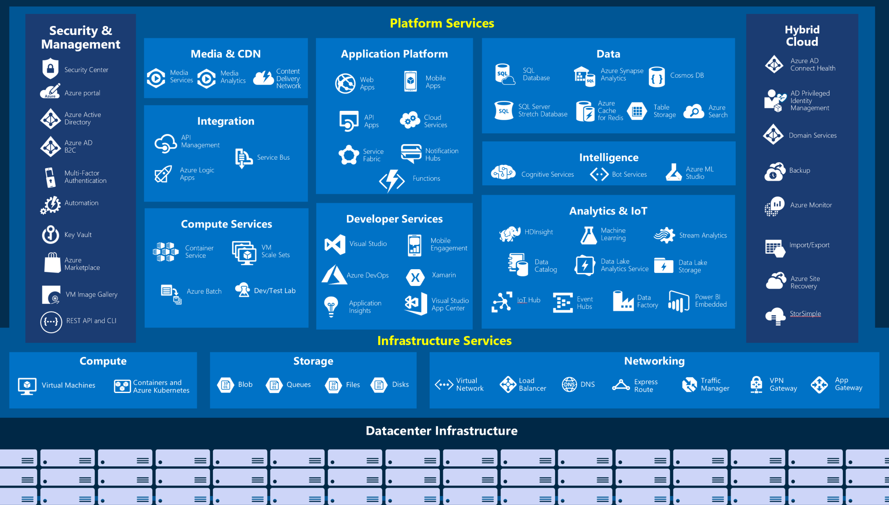
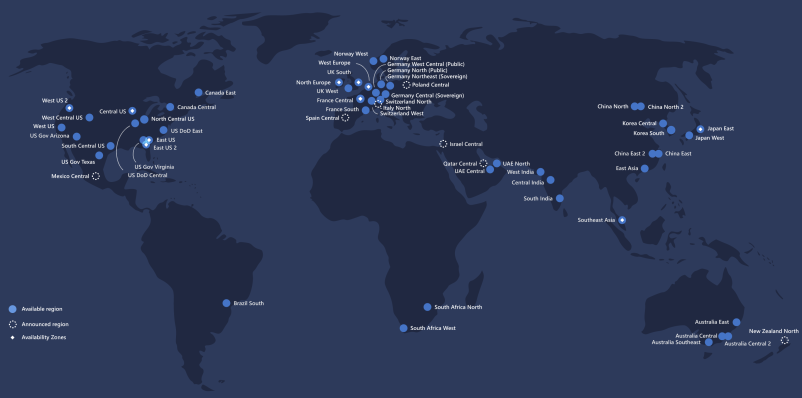

# Learining Objectives ☁

- Explore common cloud computing services.
- Explore the benefits of cloud computing.
- Decide which cloud deployment model is best for you.

# Cloud Computing

- **Clond Computing is renting resources** on another company's computers.
  - **storage spaces or cpus**
    - example of cloud providers : **Microsoft, Amazon and Google**
- Cloud provider is responsible for physical hardware required.
  1. Keeping hardware up-to-date.
  - Compute services usually offered includes.
    1. **Compute power** Linux servers and web applications used for computation and processing tasks.
    2. **Storage** Files and databases.
    3. **Networking** such as secure connections between the cloud provider and your company.
    4. **Analytics** Such as visualizing telemety and performance data.

# Cloud Computing Services

- The goal is to make business easier and more efficient.
  - **small start-up or a large enterprise**
    - Every business is unique and hass different needs.
      - To meet these needs, **clound computing provides offers a wide range of services**

All the services in details 👇

# Compute Power

- Consider:
  - When you send an email, book a reservation on the internet, pay bills online
    - You're interacting with cloud-based servers that doing some processing.
      - **Processing each request and returning response.**
  - As consumers, we're all dependent on the computing services on the internet.
- When **building solutions using cloud computing**.
  - You choose how you want to work based on your **resources and needs**
  - If you **need more control and responsiblity over maintenance**
    - Create a \_virtual machine (VM).
      - A **VM** is an emulation fo a computer (exact as your **desktop or laptop**)
        - A Vm includes an **operating system** and **physical hardware**.
        - You can install software's you need for your cloud requirements.
  - You _don't have to buy any of hardware or install the OS._ The cloud provider runs your virtual machine on their physical servers in **data centers**
    - Sharing the physical server with VMs (isolated and secure)
- With the cloud, you can have a VM ready to go in minites.

  - at less cost than a physical computer.

- Vms aren't the only computing choice: other popular options are:
  - container and serverless computing.

## What are containers?

- **Containers** provides a consistent, isolated execution envs for apps.
- They're similar to _VMS_ except the don't require a \*_guest Os_.

  - The application and all its dependecies is packaged into a **container**.
  - The \_\_standard runtime env\*\* is used to execute the app.
  - Allows containers to start up in just seconds since there is no **Os to boot**
    - You anly neet the app to launch.

- The open-source project, **Docker** is the leading container management platform.
- Docker containers provide an efficient, lightweight approach to deploy apps.
  - Allow different compoenets of the application to be deployed independently.
    - **microservices**
  - Multiple containers can be run on a single machine, and container be moved btw machines.
  - The **portability** of the containers makes it easy for applications to be deloyed in multiple environments.
    - **on-premises or in the cloud** deploments

### What is serverless computing?

- **Serverless computing** lets you run application code without creating, configuring , or maintaining a server.
- The core idea is that your applicaiton is broken into separate functions that run when triggered by some action.

  - This is ideal for automated tasks -
    - for example, you can build a \*\*serverless process that automatically sends an email confirmation after a customer makes an online purchase.

- The **serverless** model differ from VMs and Containers in the following.

  - You only pay for **Processing time** used by each function as it executes.
  - VMs and contaners are charged while they're running- even if application is idle.

- This serverless architecture **doesn't work for every app.**
- When you app logic can be separated to independent units.
  - You can test them separately, update them separately and launch them in microseconds.
- This is the \*\*fastest option for deployment.


# Storage

- Most devices and applications read and/or write data.
  - Buying a movie ticket online 🎥 Looking up the price of an online item 🔥 Taking a picture 🖼 Sending and email 📧
- In all all the cases, data is either read (looking up a price) or written (taking a picture).

  - The type of data and how it's stored can be different in each of these cases.

- **Cloud provider typically offers services** that can handle all of these types of data.
  - **blob storage** , **relational databases**

The advantage of cloud-based storage is you can scale to meet your needs. If you nned more space to store your movie clips, you pay a little more and the space is available. In some cases the space can even expand and contract automatically.

## Summary

Every business has different needs and requirements. Cloud computing is **flexible** and **cost-efficint** which can be beneficial to every business, whether it's a small start-up or a large enterprice.

# Benfits of Cloud Computing

- Companies can choose to use the cloud to store their data and execute logic as much, or a little as necessary to fullfill their business requirements.

## It's cost-effective

Cloud computing provides a **pay-as-you-go** or **consumption-based** pricing model.

- This consumption-based model brings with it many benefits.

  - No upfront infrastructure costs.
  - No need to purchase and manage costly infrastructure that you may not use its fullest
  - The ability to pay for additional resources only when they are needed.
  - The ability to stop paying for resources that are no longer needed.

- Also allows for better cost prediction. Prices for individual resources and services are provided so you can predict how much you will spend in a given billing period based on your expected usage.

## it' scalable

- You can increase or decrease the resources and services used based on the demand or workload at any given time. Cloud computing support both **vertical** and **horizontal scaling** depending on your needs.

- **Vertical scalling** also known as **scalling up**

  - The process of addnig resources to increase the power of an existing server.
    - Addng **more CPUs and adding more memory**

- **Horizontal scalling** also know as **scaling out**

  - The process of adding more servers thats function together an one unit.
    - you have more that one server processing incoming request.

- Scaling can be done manually or automatically based on specific triggers such as.
  - **CPU utilization** , number of requests and resources

## it's elastic

As your workload changes due to a spike or drop in demand, a cloud computing system can compasate by automatically adding or removing resources.

If your **news article** get a spike in traffic overnight. Since the cloud is elastic, it automatically allocates more computing resources to handle the increased traffic. When the traffic begins to normalize, the cloud automatically de-allocates the additional cost to minimize cost.

## it's current

Cloud usage eliminates the burdens of maitaining software patches, hardware setup upgrades and other it management tasks.

All of this is automaticall done for you to ensure you're using the latest and greatest tools to run you business.

- Cloud provider is reponsible of replacing failed disks.
  - Cloud provider will ensure that the hardware updates are made available to you autmatically.

## it's reliable

When you'r runnig a businness, you want to be confident your data is always going to be there.

- Cloud computing provides:
  1. data backup
  2. disaster recovery
  3. data replication services to make sure your data is always safe.

**reduduncy** is often built into cloud services architecture so if one component fail, a backup componets takes its place. Usually reffered to as **fault tolerance**.

## it's global

Cloud provider have fully redundand datacenters located in various regions all over the globe. This gives you a local presence close to your customers to give them the best response time possible no matter where in the world they are.

You can replicate your services into multiple regions for redundancy and locality, or select a specific region to ensure you meet \*\*data-residency and compliance laws for you customers.

## it's secure

Cloud provider offers a broad set of policies, technologies, controls and expert technical skill that can provide better security that most organizations can otherwise achieve.

When it comes to **physical security** - threats to cloud infractructure, cloud providers invest heavily in wals, cameras , gates , security personnel.

**Digital security**. You want only authorized users to be able to log into virtual machins or storage systems running in the cloud.

### CC Benefits Summary

- Cloud computing makes running a business easier.
- it's cost-effective, scalable, elastic,current, reliable and secure.

## Compliance terms and requirements

- When selecting a cloud provider to host your solution.
  - You should understand how that provider can help you comply with requlations and standards.
- Some questions to ask about a potential provider includes:
  - How compliant is the cloud provider when it comes to handling sensitive data?
  - How complaint are the services offered by the cloud provider?
  - How can I deploy my own cloud-based solutions to scenarios that have accreditation or compliance requirements?
  - What terms are part of the privacy statements for the provider?

### Compliance Offerings

- **Criminal Justice Information Services(CJIS)**

  - Any **us state or local agency** that wants to access the **FBI's CJIS** database is required to adhere to the **CJIS security Policy**.
  - **Azure** in the only majar clound provider that contractually commits to conformance with the CJIS security Policy, which commits **Microsoft** to adhering to the same requirements that law enforcement and public safety entities must meet.

- **Cloud Security Alliance (CSA) STAR Certification**

  - Azure, intune and Microsft Power BI have obtained STAR certificaiton.
    - Involves a rigorous independent third-party assessment of cloud provider security posture.
  - STAR certification is based on achieving ISO/IEC 270001 certification and meeting criteria specified in the cloud controls Matrix**CCM**.
  - Certfication demonstrates that a cloud service provider:
    - Conforms to the applicable requirements of ISO/IEC 27001
    - Has addressed issues critical to cloud security as oulined in the CCM.
    - Has been assessed against the STAR capability Maturity Model for the management of activities in CCM control access.

- **Eu Model Clauses**

  - Microsoft offers customers EU standard Contractual Clauses that proide contractual guarantees around transfers of personal data outside of the EU.
  - Microsoft is the first protections Azure delivers to its enterprise cloud customers meet current EU standards for international transfer of data.

  - This ensures that Azure customers can use Microsoft services to move data freely through Microsoft'c cloud from Europe to the rest of the world.

  - **General Data Protection Regulation (GDPR)**

  - As of May 25,2018, a European privacy lay --GDGR-- is in effect.
  - GDPR imposes new rules on companies, government agencies, non-profits, and other organiztion that offer goods and services to people in the European Union (EU), or that collect and anlyze data tied to EU residents.

  - **Health Insurance Portability and Accountability Act (HIPAA).** Hippa is a US federal law that regulates patients Protected Health Information (PHI).
  - Azure offerst customers a HiPAA business Assoiate Agrement (BAA), stipulating adherence to certain security and privacy Provisions in HIPAA customers.

  - **Intenational Organization for Standardization (ISO) and the International Electortechnical commission (IEC) 27018.** Microsoft is the firt cloud provider to have adopted the ISO/IEC 27018 code of practise, covering the processing of persoal information by cloud servie providers.

  - **Multi-Tier Cloud Security (MTCS) Singapore** After rigorous assessments conducted by the MTCS certication Body, Microsoft cloud services received MTC 584:2013 certification across all three service classification:

  - Infrastructure as a Service (IaaS)
  - Platform as a Service (PaaS)
  - Software as a Service (Saas)

- Microsoft was the firt global cloud solution provider (csp) to receive this certifiation across all three classifications.

-**Service Organization Controls (SOC)1, 2 and 3**

- Microsoft-covered cloud services are audited at least annually against SOC report framework by independet third-party auditors.
- The Microsoft cloud services audit covers controls for data security,availability,processing integrity and confidentiality as applicable to in-scope trust principles for each service.

- **National Institute of Standards and Tecnology (NIST) cybersecurity Framework (CSF)**

- Nist CSF is a voluntary Framework that consist of standards, guidelines and best practices to manage cybersecurity-related risks.
- Microsoft cloud services have undergone independent, third party Federal Rish and Authorization Management Program (FedRAMP) Moderate and High Baselne audits.

- **Uk Government G-Cloud**

  - The Uk Government G-cloud is a cloud computing certification for services used by government entities in the United kingdom.
  - Azure has received official accreditation from the **UK Government Pan Government Accreditor**.

## Economies of scale

- **Economies of scale** is the ability to do things more efficiently or at a lower cost per unit when operating at a larger scale. The cost advantage is an important benefit in cloud computing.

- Cloud providers such as **Microsoft, Google an Amazon** are large businesses leveraging the benefits of economies of scale. These providers can then pass the savings on to their customers.

- These savings are apparent to end users in a number of ways , one of which is the ability to acquire hardware at a lower cost. Cloud provider can also make deals with local governments and utilities to get tax saving lowering the prices of \*\*power, cooling, and high-speed network connectivity between sites.

## Capital expediture (CAPEX) versus Operatinal Expediture (OPEX)

- In the past compainies needed to **acquire physical premises and infrastructure to start their business**. There was a substantial up-front cost in hardware and infrastructure to start or grow a business.

- Cloud computing provides services to customer without signficant upfront costs or equipment setup time

- These two approaches to investent are referred to as:

  - **Capital Expenditure (CapEX)**
    - Money spent on physical Infrastructure up front - expense from your tax bill over time.
  - **Operational Expenditure (OpEx):**
    - Money spent on services or products now and being billed from you - tax bills.
    - no upfront cost. You pay for a service or product as you use it.

### CapEX computing Costs

- A typical on-premises datacenters includes costs such as:

### 1. Server costs

- This area includes all hardware componets and the cost of supporting them.
- When purchasing servers, make sure to design **fault tolerance and redundancy**
  - Such as \_\_server clustering, redundant power supplies.
  - Uninterruptible power supplies.
- When a sever needs to be replaced or added to a datacenter you need to pay for the computer.
- This can affect your immediate **cash flow** because you must pay upfront.

### 2. Storage costs

- This area includes all storage hardware componets and the cost of supporting it.
- Based on the application and level of **fault tolerance**, **centralized storage** can be expensive

### 3. Network Costs

- Network costs includes all on-premises hardwaer components, including **cabling**, **switches**, **access points** and routers.
  - This also includes **wide area network (WAN) and internet connections**

### 4. Backup and arhcive costs.

- This is te cost to back up, copy or archive data. Options might include settings up a backup to or form the cloud.
- There's an upfront const for te hardware and additional cost for backup maintenance and consumables like tapes.

### 5. Organization Continuity and disaster recovery costs.

- Along with server fault tolerance and redundancy, you need to plan for how to recover from a distaster and continue operating .

### 6. Techincal personnel.

- While not a capital expenditure, the personnel required to work on your infrasture are specific to on premises datacenters.
- You will need the techinical expertise and workforce to install, deploy and manage the systems in the datacenters and at the disaster recovery site.

## OpEX cloud computing costs

- Using a **pay-per-use** model requires actively managing your subscription to ensure users do not misuse the services, and that provisioned accounts are being utilized and not wasted

- As soon ase the provider provisions resources, billing starts.
  - its your responsibility to de-provision the resources when they aren't in use so that you can minimize costs.

### Leasing software and customized features

Using a **pay-per-use** model requires actively managing your subscriptions to ensure users do not misuse the services and that provisioned accounts are being utilized and not wasted.

### Scaling charges based on Usage/demand instead of fixed hardware or capacity.

Cloud computing can bill in various ways, such as the number of users or CPU usage time, However, billing categories can also include **allocated RAM**, **I/O operations per seconds (IOPS) and storage space**

### Billing at the user or organization level.

- The subscription (pay-per-use) model is a computing billing method that is designed for both organizations and users.
- The organization or user is billed for the services used, typically on a recurring basis. You can **scale**, **customize** and **provision computing resources**
  - software , storage and developmet platforms.

### Benefits of CapEx

With capital expeditures, you plan your expenses at thes start of a project or budget perion. Your cost are fixed, meaning you know exactly how much is being spent.

### Benefits of OpEx

- Demand and growth can be unpredicatable and can outpace expecatation, which challages the CapEX model.
- With the **OpEx** model, companies wanting to try a new product or services don't need to invest in equipment.
- OpEx is particularly appealing if the demand fluctuates or is unknown. Cloud services are often said to be **agile**.

- **Cloud agility** is the ability to rapidly change an IT infrastructure to adapt to the evolving needs of the business.
- If your service peaks one month, you can scale to demand and pay a larger bill for the month.
- If your service drops you can scale you can reduce the used resources and be charged less.

## Cloud Deployment models

- A cloud deployment model defines where your data is store and how your customer interact with it.
- how do they get to it and where do the application run?
- It also depends on how much of your own infrastructure you want or need to manage.

### Public Cloud

- Most common deployment model.
  - You have no local hardware to manage or keep up-to-date.
    - everthing runs on your cloud provider's hardware.
- You save additional cost by sharing computing resources with other cloud user.
- Businesses can use multiple public cloud providers of varying scale.
  - Microsoft Azure is an example of public cloud provider.

#### Advantages

- **High scalability/agility** -- you don't have to buy a new server in order to scale.
- **Pay-as-you-go pricing** - You pay only for what you use, no CapEX costs.
- You're not responsible for maintenance or update of the hardware.
- Minimal technical knowledge to set up and use - you can leverage the skills and expertise of the cloud provider to ensure workloads are secure, safe and highly available.

#### Disadvantages.

Not all scenarions fit the public cloud.

1. There may be specific security requirements that cannot be met using public cloud.
2. There may be government policies , industry standards or legal requirements which public clouds cannot meet.
3. You don't own the hardware or services and cannot manages them as you may want to .
4. Unique business requirements, such as having to maintain a legacy application might be hard to meet.

### Private cloud

- In a private cloud you create a cloud environment in your own datacenter and provide self-service access to compute resources to users in your organization. This offers a simulation of a \*\*public cloud to your users but you remain completely responsible for the purchase and maintenace of the hardware and software services you provide.

### Advantages of Private cloud

- You can ensure the configuration can support any scenario or legacy application
- You have control (and responsibility) over security
- Private clouds can meet strict security, compliance, or legal requirements

### Disadvantages of Private cloud.

- You have some initial **CapEX** costs and must purchase the hardware for startup and maintenance.
- Owning the quipments limits the agility - to scale you must buy , install and setup new hardware.
- Private clouds require IT skills and expertise that's hard to come by.

## Hybrid cloud.

A hybrid cloud combines public and private clouds, allowing you to run your application in the most appropriate loation.

- You could host a website in the public cloud and link it to a highly secure database hosted in your private cloud (or no-premises datacenter)

- This is helpul when you have some things that cannot be put in the cloud, maybe for legal reasons.
- example (**medical data**).

### Hybrid cloud Advantages.

- You can keep any system running and accessible that use out of date hardware or an out-of-date operating system.
- You have flexibility with what you run locally versus in the cloud.
- You can take advantage of \*\*economies of scale from the public cloud provider for services and resources where it's cheaper and then supplement with your own equipment when it's not.
- You can use your own equipment to meet security, compliace or legacy scenarios where you need to completely control the environment.

### Disadvantages

- It can be more expensive than selecting one deployment model since it involves some **CapEx** cost up front.
- It can be more complicated to set up and manages.

Cloud computing is flexible and gives you the ability to choose how you want to deploy it. The cloud deploment model you choose depends on your budget and on your security , scalability and maitenance needs.
o

## Types of Cloud Services

### Infrastructure as a service (Iaas)

- Infrastructure as a service is the most flexible category of cloud services.
  - It aims to give you the most contraol over the provided hardware runs your application.
    - IT infractructure servers and **virtual machines (Vms), storage and Operating systems.**
- Instead of buying hardware, you rent it. It's an instant computing infrastructure, provisioned and managed over the internet.

IaaS is commonly used in the following scenarions:

- **Migration workloads** Iaas facilities are managed in a similar way as on-premises infrastructure and provides an easy migration path for moving existing application to the cloud.

- **Test and Development**. Teams can quickly set up and dismantle test and development environments, bringing new application to market faster. Iaas makes scaling development and testing environments fast and economical.

- **Storage, backup and recovery** Organizations avoids the capital outlay and coplexity of storage management which typically require skilled staff to manage data and meet legal and copliance requirements.

### Platform as a Service (PaaS)

- PaaS provides an evironment for building, testing and deploying software applications.
  - Help you create an application quickly without managing the underlying infrastructure.
- Platform as service is the best choice here becaouse the Paas services handles the IT management tasks for you, so you can focus on writing code.

## Software as a service (SaaS)

- Saas is software that central hosted and manage for the end customer.
- usually based on an architecture where one version of the application is used for all customers and licensed through a monthly or annual subscription (office 365, Skype and Dynamic CRM online)


- **IaaS** requires the most user management of all the cloud services. The user is responsible for managing the operating systems, data, and applications.
- **PaaS** requires less user management. The cloud provider manages the operating systems, and the user is responsible for the applications and data they run and store.
- **SaaS** requires the least amount of management. The cloud provider is responsible for managing everything, and the end user just uses the software.

### Combine cloud services to fit your needs.

Iaas, Paas and SaaS each contains different levels of managed services.

You man easily use a combination of these types of Infrastructure . You could use **office 365** on your company's computer (Saas) and in Azure , you could host your VMs (laas) and use \*\*Azure SQl Database (Paas) to store your data.

## Microsoft Azure.

Azure is Microsoft's cloud computing platform . Azure provides over 100 services that enables you to do everything from running your existing application on virtua machines to exploring new software paradigms such as intelligent bost and mixed reality.

Here are just a few kinds of services you'll find on azure.

- **Compute** services such as VMs and containers that an run your applications.
- **Database** services that provide both relational and NoSQL choices.
- **Identity** services that help you authenticate and protect your users.
- **Networking** services that connect your datacenter to the cloud, provide high availability or host your \*\*DNS domain.
- **Storage** solution that can accommodate massive amounts of both structured and unstructured data.
- **AI and machine-learning** services can analyze data text, images , comprehead speech and make prediction using data - changing the world of agriculture, healthcare

## Creating an azure account.

- To create and use Azure services

  - You need an Azure subscription.

- When you sign up , an **Azure subscription is created for you**
  - It allows you to build and deploy cloud-based applications.
    - sophisticated artifial intelligence service.
    - extract essential insights from your data.

### Learning Objective

- Learn about Azure sign-up options including Azure free account.
- Create an Azure free account.
- Understand how biling works in Azure.
- Learn about different support options.

## What is the Azure free account?

- The azure free account includes free access to popular Azure products for 12 months.
  - \$200 USD credit to spend for the first 30 days and more than 25 product that are always free.
  - This is an excellent way for new users to get started and explore.
  - To sign up, you need a phone number, a credit card and Microsoft or Github account.
    - Credit card information is used for identity verification only.
    - You won't be charged for any services until you upgrade.

## Azure purchasing options.

1. **Azure.com**: Buing directly through **Azure.com** is the fastest and easiest way to organization of all sizes to get started with Azure.

2. **Microsoft representative** Buying azure through a microsoft representative is intended for large organization or customers who already work with one.

3. **Microsoft partner** if you buy Azure as a managed service through your partners, your partners will provie you with access to Azure, manage your billing and provide support.

## sign up for free account.

1. In a web browser, go to https://azure.microsoft.com/free.
2. **Start free**

## Undertand Azure billing

- With azure you pay what you use
  - You'll receive a monthly invoice with payment instruction provided.
  - You may organize your invoice into line to make sense to you and meed your budget and cost tracking needs.

### Azure subscription

- When you sign up, an azure subscription is created by default.

  - An Azure subscription is a logical container used to provision resources in Azure.
  - It holds the details of all your resources like virtual machines (VMs), databases

- When you crate an Azure resource like a VM, you identify the subscription it belongs to.
  - As you use the VM, the usage of the VM is aggregated and billed monthly.

### Create additional Azure subscriptions.

- You might want to create additional subscriptions for resource or billing management purposes.

  - You might choose to create additional subscription to separate.

- **Environments** When managing your resoures, you can choose to create subscriptions to set up separate envrionments for development and testing, security or to isolate data for compliance reasons.

- **Organzational Structures** You can create subscriptions to reflect different organizational structures. You could limit a tea to lower-cost resources, while allowing the IT department a full range.

- **Billing** You might want to create additional subscriptions for billing purposes. Because cost are first aggregated at the subscription level, you might want to create subscriptions to manage and track costs based on your needs.

You might also need additional subscription due to.

- **subscription limits** If you want your application to go over those limits in particular scenarions then you might need additional subscriptions.

### Customize billing to meed your needs.

- If you have multiple subscription, you can organze them into invoice sections.

  - Each invoice section is a line item on the invoice that shows the charges incurred that month.
  - Depending on your needs you can set up multiple invoices witin the same billing account.

- Each billing profile has its own monthly invoice and payment method.


## Azure support options

If you have question around azure services or curious about its capabilities

## Azure free support resources.

- 24/7 access to online documentation , community support.
  - new Azure capabilities demo
    - created by **Azure engineers, availabe on Azure friday**
  - Microsoft Mechanics and Azure portal how-to videos playlists.
- As an Azure customer, the following free support resources are availables.
  - Billing and subscription management support.
  - Azure Quickstart Center, a guided experience in the Azure portal available to anyone.
  - Azure Service Health gives you insights on isers related to Azure services.
  - Azure advisor gives you personalizerd recommedateon on how to optimize your cost and performance.

### Azure support plans

- Azure offers customers reactive and proactie technical support.

  - Choose support plan that bes meed your needs. You can purchase the support plan on azure site.

|                             | Developer               | Standard                           | Professional Direct                                   |
| --------------------------- | ----------------------- | ---------------------------------- | ----------------------------------------------------- |
| Best for                    | Non-critical workloads  | Production workloads               | Business-critical workloads                           |
| Reactive technical support  | 1 business day response | 1-hour response for critical cases | 1-hour response + priority tracking of critical cases |
| Proactive technical support | Not applicable          | Not applicable                     | Access to a pool of technical experts                 |

### Azure comminity support

- Ask questions, get answers, and connect with Microsoft engineers and comminity experts

| Channel                  | Description                                                                                          |
| ------------------------ | ---------------------------------------------------------------------------------------------------- |
| Azure Knowledge Center   | The Azure knowledge Center is a searchable database that contains answers to common support question |
| Microsoft Tech Community | Reading responses to Azure techinical questions form Microsoft's developers and testers              |
| Microsoft Q&A            | Find answers to yonur techincal questions about selected Azure products                              |
| Stack Overflow           | You can review answers to question from the development community.                                   |
| Server Fault             | Review community responses to question about system and Network Adminstartion in Azure.              |
| Azure Feedback Forums    | Read ideas and suggestions for improving Azure made by Azure users.                                  |
| Twitter                  | Tweet @AzureSupport to get answers and support from the official microsoft Azure Twitter channel.    |

## Core Cloud Services INtroduction to Azure

### Objective

1. Learn what Microsoft Azure is and how it relates to cloud computing.
2. Deploy a website using Azure App Service.
3. Learn how to scale up your website to give you more compute power
4. use Azure cloud shell to interact with your website.

- The cloud helps power your everyday life and it's often present in ways you don't realize.
  - We believe technology creates opportunity.
  - To keep up with today's ever-changing digital world, understand cloud technology can help align your career to this exiciting revolution.

## What is Azure?

Azure is Microsoft's cloud computiong platform. Azure is a continually expanding set of cloud services that help your organization meed your current and future business challenges.

- Azure gives you the freedom to build, manage and deploy applications on a massive global network using your favorite tools and frameworks

## what is cloud computing?

- cloud computing is the delivery of computing services onver the internet using **Pay-as-you-go** pricing model.
- Put another way, it's way to rent compute power and storage from someone else's data center
- Instead of maintaining CPUs and storage in your data centers, you rend theme for the time you need them. The cloud provider takes care of maintaining the underlying infrastructure for you.

### Why should i move to the cloud.

The cloud helps you move faster and innovate in ways that wer once nearly impossible.

- In over ever-changing digital world, two trends emerge:

  - Teams are delivering new features to their user at record speed.
  - End users expect and incresingly rich and immersive with their devices and with software.

- Releases are now often sheduled in terms of days or weeks.

  - Some teams even deliver software updates continuously
    -sometimes with multiple releases within the same day.

- The cloud provide on-demand acess to:
  - A nearly limitless pool of raw compute, storage and networking components
  - Speech recognition and other cognitive services that help make your application stand out from the crowd.
  - Analytics services that enables you to make sense of telemetry data coming back from your software and devices.

### How Azure fits in in Cloud computing

- Azure provides over 100 services that enables you to do everthing from running your existing app on vms to exploring new software paradigm such as inteligent bots and mixed reality.

- Many teams start exploring the cloud moving their existing application to virtual machines that run in Azure.

- Azure provide AI and Machin-learning services that can naturally communicate with your users through vision , hearing and speech. It also provides storage solutions that dynamicall grow to acoommodate massive amounts of data.
- Azure services enables solutions that are not feasible without the power of the cloud.

## Tour of Azure services



Let's take a closer look at the most commonly used categories:

### Compute

- Compute services are often primary reason why companies move to the Azure platform
  - Azure Virtual Machines (**windows, linux VMs hosted on Azure**)
  - Azure Virtual Machine Scale Sets (**scalling for windows or linux vms**)
  - Azure kubernetes service (**Enables management of a cluster of Vms that runs containerized services**)
  - Azure service Fabric (**Distribute systems platform. Runs in Azure or on-premises**)
  - Azure Batch - Manage services for **paraller and high-performance computing applications**
  - Azure Container Instances - Run containerized apps on Azure without provisioning servers
  - Azure funcitions - An event-driven , serverless compute services.

### Networking

- Linking compute resources and providing acess to application is the key function of Azure networking.
- Azure virtual Network - connect Vms to Incoming VPN connections.
- Azure Load Balancer - Balances inbound and outboud connections to app or sevice endpoints.
- Azure application Gateway - Optimizes app server farm deliverly increasing security.
- Azure DNS - Provides ultra-fast DNS responses and ultra-high domain availability.
- Azure Content Delivery Network - Delivers high-bandwidth content to cutomer globally.
- Azure Traffi Manger
- Aure network watcher
- Azure firewall
- Azure Virtual Wan

### Storages

- Azure blob storage.
- Azure file storage.
- Azure queue storage.
- Azure Table storage

Thes services all share several common characteristics

- Durable and highly available with redundancy and replication.
- Secure through automatic encryption and role-based access control.
- Scalable with virtually unlimited storage.
- Managed, handling maintenance and any critical problems for you.
- Accessible from anywhere in the world over HTTP or HTTPS.

### Mobile

- Azure enables developers to create mobile backends for ios, Android, and windows apps quickly and easily.
- Adding feauture that would other wise take time, such as adding corporate sign-in and the connecting to on-premises resources such as **SAP, Oracle, SQL server and sharepoint**

- More feauter of this service includes:
  - offline data synchronization
  - Connectivity to on-premises data.
  - Broadcasting push notifications.
  - AutoScaling to match business needs

### Databases

- Azure Cosmos DB - **Globally distributed database that supports: NoSql options**
- Azure SQL Database - **Full managed relational database with auto-scale**
- Azure Database for PostgresSQL - **Fully managed and scalable PostgresSQL**
- Sql server on vms - **Hot enterprise SQL server apps in the cloud**
- Azure Cache for Redis - **Caches frequently used and static data to reduce data and application latency**
- Azure Database for MariaDB - **Fully managed and scalable MariaDb relational database with high availablility and security**

### Web

- Azure App Service - **quickly create powerful cloud web-based apps.**
- Azure Notification Hubs - **Send push notifications to any platform from any back end**
- Azure Api Management - **Publish Apis to developers,partners and employess securely and at scale.**
- Azure Cognitive Search - **Fully managed search as a service.**
- Web Apps features of Azure App Service - **Create and deploy mission-critical web apps at scale.**
- Azure signalR service - **Add real-time web functionalities easily.**

### Internet of Things

- IoT Central - **Fully-managed global IoT software as a service (Saas) solutions that makes it easy to connect, monitor and manage your IoT assets at scale.**
- Azure Iot Hub - **Messaging hub that provides secure communications between and monitoring of millions of IoT devices.**
- IoT Edge - **Push your data analyis models directly onto your IoT devices allowing them to react quickly to state changes without needing to consult cloud-based AI model.**

### Big Dataa

- Azure Synapse Analtics - **run analytics at a massive scale usind a cloud-based Enterprise Data Warehouse(EDW) that leverages massive parallel processing (MPP) to run complex queries quickly across petabytes of data.**
- Azure HDInsight - **Process massive amounts of data with managed cluster of Hadoop cluster in the cloud.**
- Azure Databricks - **Collaborative Apache Spack-based analytics service that can be intergrated with other Big Data services in Azure.**

### Artificial Intelligence

### DevOps

- Azure Devops - **Azure DevOps services, provides development collabcation tools including high-perfomance pipelines fre private git repositories, configarable kanban boards**

- Azure DevTest Lab - **Quickly create on-demand Windows and Linux environment you can use to test or demo you applications directly from you develoyment pipeline.**

Task

1. Deploy a wordpress site to azure
2. Congure appsevice

#### What is Scale?

- **scale** refers to adding network bandwidth, memory,storage and compute power to achieve better performance.
  - Scaling up and Scaling out.

**Scaling up** or **vertical scaling** means to increase the memory,storage or compute power on an existing example, you might create many virtual machine configured in exactly the same way and use a load balancer to distribute work across them.

**Scaling out or horizontal scaling** means to add extra virtual machine to power your application. For example, you might create many virtual machine configured in exactly the same way and use a local balancer to distribute work across them.

#### How to change the App service configuration

- The app services has many configurable options available and groups these options in sections of functionality.

The **setting**sections givec you acess to configure various aspects such as application settings, backups , custom domains , Tls/ssl settings, options to scale up the resources of the application.

#### Scale up your App service.

1. In the **settings** configuration section for your app service, select **Scale up (APp service plan)**

2. Notice that there are three workload categories to choose from in the configuration pane. These three categories make it easier to decide the type of workload we'll run.

| category   | Decription                                                                                                                      |
| ---------- | ------------------------------------------------------------------------------------------------------------------------------- |
| Dev/Test   | This category is ideal for less demanding workloads. This category is predominantl focused on providing shareid infrastructure. |
| Production | This category is ideal for more demandings workloads.                                                                           |
| Isolated   | This category is ideal for workloads that require advanced networking and fine-grained scalling.                                |

- Within each category, there are pricing tiers that will allow us to scal the resources available to our app service.

### Exercise - Acess an App Servise using Azure cloud Shell.

- Azure portal offers a convinient user interface to search, install and access the varionus Azure offering available.

#### What is Azure cloud shell?

- Azure cloud shell is browser-based command-line experience for managing and developing.- Azure resource.

- cloud shell provides two experiences to choose from, Bash and powerShell.

  - Both include access to azrure command-line interface called **Azure CLI and Azure Powershell**
  - you can use any Azure management Interface **Azure portal, Azure cli, Azure Powershell** to manage Azure resources.

- Let shutdown **Azure sites using cli**

  - makes sure that we work with the correct Azure subscription before changing any setting.

```bash
az account list --output table
```

2. Recall that we use a precreated resource group called **learn-7aisntnstnisntnt** when we created our website.

```bash
az group list --output table
```

3. Next we'll list all the resources in the **learn-71434** using the **az resource list** command.

#### Clean up.

- The sandbox automatically cleans up your resourcesc
  - When you're working in your ow subscription - at the end of project identify whether you still need the resources you created.

## Core cloud Service - Azure architecture and service guarantees.

- Azure provide a global network of securu datacenters you can deploy your service into.
- Learn about physical architecture of Azure, how redundancy is provider.

You're a small business owner with a great set of web-browser.

- This problem used to be expensive to solve - requiring new data centers and costly networks.

**Microsoft Azure** provides a reliable, redundant, energy-efficient infrastructure that spans more than 100 highly secure facilities worldwide.

- **global reach**,**local presence** keep your data secure and complient with loal laws

### Undertand Datacenters and Regions in Azure.

- Microsoft Azure is made up of datacenters located around the globe.
  - When you leverage a service or create a resource such as SQL database or **virtual machine**, you are using physical equipment in one or more of thes locations.

### What is a regions?

A **region** is a geographical on the planet containing at least one, but potentiallly multiple datacenter that are nearby and networked together with a low-latency network.

**Azure** intelligently assigns and controls the resources withing each region to ensure workloads are appropriately balanced.

- when you deploy a resource in azure you will often need to chooce the region where you want your resources deployed.

- Example of regions
  - West US
  - Canada
  - West Europe
  - Australia East
  - Japan West



### Why is this important?

- Azure has more global regions than any other cloud provider.
- This gives you the flexibility of bring applications closer to your users no matter where they are
  - It also provide better \*_scalablity, redundancy and preserves data residency for your services_

### Special Azure regions.

Azure has specialized regions that you might want to use when building out your application for compliance or legal purposes. These include

- US DoD central ,US Gov Virginia US Gov lowa
- China EAST, China North and more

Regions are what you use to identify the location for your resources, but there are two other terms you should also be awaer of: geographies and availabilities zones.

### Understand Geographies in Azure.

- Azure divides the world into **geographies**that are difined by geopolitical boundaries or country borders. An Azure geography is a discrete market typically containing two or more regions that preserve data residency and compliance boundaries.

- Geographies allow cutomer with specific data residency and compliance needs to keep their data and application close.
- Geographice ensure that data residency, sovereigty, compliance and resiliency requirements are honored within geographical boundaries.
- Geographies are fault-tolerant to withstand region failure through their connection to dedicate high capacity networking infrastructure.

**Data residency** refers to the physical or geographic location of an organization's data or information. It defines the legal or regulatory requirements imposed on data based on the country or region in which it resides and is an important consideration when planning out your application data storage.

Geographices are broken up into the following areas:

- Americas
- Europe
- Asia pacific
- Middle East and Africa

Each region belongs to a single geography and has specific availability, complance and data residency/sovereignty rules applied to it.
