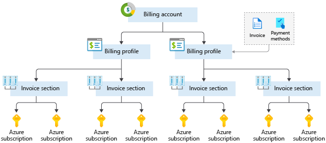

# Learining Objectives ☁

- Explore common cloud computing services.
- Explore the benefits of cloud computing.
- Decide which cloud deployment model is best for you.

# Cloud Computing

- **Clond Computing is renting resources** on another company's computers.
  - **storage spaces or cpus**
    - example of cloud providers : **Microsoft, Amazon and Google**
- Cloud provider is responsible for physical hardware required.
  1. Keeping hardware up-to-date.
  - Compute services usually offered includes.
    1. **Compute power** Linux servers and web applications used for computation and processing tasks.
    2. **Storage** Files and databases.
    3. **Networking** such as secure connections between the cloud provider and your company.
    4. **Analytics** Such as visualizing telemety and performance data.

# Cloud Computing Services

- The goal is to make business easier and more efficient.
  - **small start-up or a large enterprise**
    - Every business is unique and hass different needs.
      - To meet these needs, **clound computing provides offers a wide range of services**

All the services in details 👇

# Compute Power

- Consider:
  - When you send an email, book a reservation on the internet, pay bills online
    - You're interacting with cloud-based servers that doing some processing.
      - **Processing each request and returning response.**
  - As consumers, we're all dependent on the computing services on the internet.
- When **building solutions using cloud computing**.
  - You choose how you want to work based on your **resources and needs**
  - If you **need more control and responsiblity over maintenance**
    - Create a \_virtual machine (VM).
      - A **VM** is an emulation fo a computer (exact as your **desktop or laptop**)
        - A Vm includes an **operating system** and **physical hardware**.
        - You can install software's you need for your cloud requirements.
  - You _don't have to buy any of hardware or install the OS._ The cloud provider runs your virtual machine on their physical servers in **data centers**
    - Sharing the physical server with VMs (isolated and secure)
- With the cloud, you can have a VM ready to go in minites.

  - at less cost than a physical computer.

- Vms aren't the only computing choice: other popular options are:
  - container and serverless computing.

## What are containers?

- **Containers** provides a consistent, isolated execution envs for apps.
- They're similar to _VMS_ except the don't require a \*_guest Os_.

  - The application and all its dependecies is packaged into a **container**.
  - The \_\_standard runtime env\*\* is used to execute the app.
  - Allows containers to start up in just seconds since there is no **Os to boot**
    - You anly neet the app to launch.

- The open-source project, **Docker** is the leading container management platform.
- Docker containers provide an efficient, lightweight approach to deploy apps.
  - Allow different compoenets of the application to be deployed independently.
    - **microservices**
  - Multiple containers can be run on a single machine, and container be moved btw machines.
  - The **portability** of the containers makes it easy for applications to be deloyed in multiple environments.
    - **on-premises or in the cloud** deploments

### What is serverless computing?

- **Serverless computing** lets you run application code without creating, configuring , or maintaining a server.
- The core idea is that your applicaiton is broken into separate functions that run when triggered by some action.

  - This is ideal for automated tasks -
    - for example, you can build a \*\*serverless process that automatically sends an email confirmation after a customer makes an online purchase.

- The **serverless** model differ from VMs and Containers in the following.

  - You only pay for **Processing time** used by each function as it executes.
  - VMs and contaners are charged while they're running- even if application is idle.

- This serverless architecture **doesn't work for every app.**
- When you app logic can be separated to independent units.
  - You can test them separately, update them separately and launch them in microseconds.
- This is the \*\*fastest option for deployment.


# Storage

- Most devices and applications read and/or write data.
  - Buying a movie ticket online 🎥 Looking up the price of an online item 🔥 Taking a picture 🖼 Sending and email 📧
- In all all the cases, data is either read (looking up a price) or written (taking a picture).

  - The type of data and how it's stored can be different in each of these cases.

- **Cloud provider typically offers services** that can handle all of these types of data.
  - **blob storage** , **relational databases**

The advantage of cloud-based storage is you can scale to meet your needs. If you nned more space to store your movie clips, you pay a little more and the space is available. In some cases the space can even expand and contract automatically.

## Summary

Every business has different needs and requirements. Cloud computing is **flexible** and **cost-efficint** which can be beneficial to every business, whether it's a small start-up or a large enterprice.

# Benfits of Cloud Computing

- Companies can choose to use the cloud to store their data and execute logic as much, or a little as necessary to fullfill their business requirements.

## It's cost-effective

Cloud computing provides a **pay-as-you-go** or **consumption-based** pricing model.

- This consumption-based model brings with it many benefits.

  - No upfront infrastructure costs.
  - No need to purchase and manage costly infrastructure that you may not use its fullest
  - The ability to pay for additional resources only when they are needed.
  - The ability to stop paying for resources that are no longer needed.

- Also allows for better cost prediction. Prices for individual resources and services are provided so you can predict how much you will spend in a given billing period based on your expected usage.

## it' scalable

- You can increase or decrease the resources and services used based on the demand or workload at any given time. Cloud computing support both **vertical** and **horizontal scaling** depending on your needs.

- **Vertical scalling** also known as **scalling up**

  - The process of addnig resources to increase the power of an existing server.
    - Addng **more CPUs and adding more memory**

- **Horizontal scalling** also know as **scaling out**

  - The process of adding more servers thats function together an one unit.
    - you have more that one server processing incoming request.

- Scaling can be done manually or automatically based on specific triggers such as.
  - **CPU utilization** , number of requests and resources

## it's elastic

As your workload changes due to a spike or drop in demand, a cloud computing system can compasate by automatically adding or removing resources.

If your **news article** get a spike in traffic overnight. Since the cloud is elastic, it automatically allocates more computing resources to handle the increased traffic. When the traffic begins to normalize, the cloud automatically de-allocates the additional cost to minimize cost.

## it's current

Cloud usage eliminates the burdens of maitaining software patches, hardware setup upgrades and other it management tasks.

All of this is automaticall done for you to ensure you're using the latest and greatest tools to run you business.

- Cloud provider is reponsible of replacing failed disks.
  - Cloud provider will ensure that the hardware updates are made available to you autmatically.

## it's reliable

When you'r runnig a businness, you want to be confident your data is always going to be there.

- Cloud computing provides:
  1. data backup
  2. disaster recovery
  3. data replication services to make sure your data is always safe.

**reduduncy** is often built into cloud services architecture so if one component fail, a backup componets takes its place. Usually reffered to as **fault tolerance**.

## it's global

Cloud provider have fully redundand datacenters located in various regions all over the globe. This gives you a local presence close to your customers to give them the best response time possible no matter where in the world they are.

You can replicate your services into multiple regions for redundancy and locality, or select a specific region to ensure you meet \*\*data-residency and compliance laws for you customers.

## it's secure

Cloud provider offers a broad set of policies, technologies, controls and expert technical skill that can provide better security that most organizations can otherwise achieve.

When it comes to **physical security** - threats to cloud infractructure, cloud providers invest heavily in wals, cameras , gates , security personnel.

**Digital security**. You want only authorized users to be able to log into virtual machins or storage systems running in the cloud.

### CC Benefits Summary

- Cloud computing makes running a business easier.
- it's cost-effective, scalable, elastic,current, reliable and secure.

## Compliance terms and requirements

- When selecting a cloud provider to host your solution.
  - You should understand how that provider can help you comply with requlations and standards.
- Some questions to ask about a potential provider includes:
  - How compliant is the cloud provider when it comes to handling sensitive data?
  - How complaint are the services offered by the cloud provider?
  - How can I deploy my own cloud-based solutions to scenarios that have accreditation or compliance requirements?
  - What terms are part of the privacy statements for the provider?

### Compliance Offerings

- **Criminal Justice Information Services(CJIS)**

  - Any **us state or local agency** that wants to access the **FBI's CJIS** database is required to adhere to the **CJIS security Policy**.
  - **Azure** in the only majar clound provider that contractually commits to conformance with the CJIS security Policy, which commits **Microsoft** to adhering to the same requirements that law enforcement and public safety entities must meet.

- **Cloud Security Alliance (CSA) STAR Certification**

  - Azure, intune and Microsft Power BI have obtained STAR certificaiton.
    - Involves a rigorous independent third-party assessment of cloud provider security posture.
  - STAR certification is based on achieving ISO/IEC 270001 certification and meeting criteria specified in the cloud controls Matrix**CCM**.
  - Certfication demonstrates that a cloud service provider:
    - Conforms to the applicable requirements of ISO/IEC 27001
    - Has addressed issues critical to cloud security as oulined in the CCM.
    - Has been assessed against the STAR capability Maturity Model for the management of activities in CCM control access.

- **Eu Model Clauses**

  - Microsoft offers customers EU standard Contractual Clauses that proide contractual guarantees around transfers of personal data outside of the EU.
  - Microsoft is the first protections Azure delivers to its enterprise cloud customers meet current EU standards for international transfer of data.

  - This ensures that Azure customers can use Microsoft services to move data freely through Microsoft'c cloud from Europe to the rest of the world.

  - **General Data Protection Regulation (GDPR)**

  - As of May 25,2018, a European privacy lay --GDGR-- is in effect.
  - GDPR imposes new rules on companies, government agencies, non-profits, and other organiztion that offer goods and services to people in the European Union (EU), or that collect and anlyze data tied to EU residents.

  - **Health Insurance Portability and Accountability Act (HIPAA).** Hippa is a US federal law that regulates patients Protected Health Information (PHI).
  - Azure offerst customers a HiPAA business Assoiate Agrement (BAA), stipulating adherence to certain security and privacy Provisions in HIPAA customers.

  - **Intenational Organization for Standardization (ISO) and the International Electortechnical commission (IEC) 27018.** Microsoft is the firt cloud provider to have adopted the ISO/IEC 27018 code of practise, covering the processing of persoal information by cloud servie providers.

  - **Multi-Tier Cloud Security (MTCS) Singapore** After rigorous assessments conducted by the MTCS certication Body, Microsoft cloud services received MTC 584:2013 certification across all three service classification:

  - Infrastructure as a Service (IaaS)
  - Platform as a Service (PaaS)
  - Software as a Service (Saas)

- Microsoft was the firt global cloud solution provider (csp) to receive this certifiation across all three classifications.

-**Service Organization Controls (SOC)1, 2 and 3**

- Microsoft-covered cloud services are audited at least annually against SOC report framework by independet third-party auditors.
- The Microsoft cloud services audit covers controls for data security,availability,processing integrity and confidentiality as applicable to in-scope trust principles for each service.

- **National Institute of Standards and Tecnology (NIST) cybersecurity Framework (CSF)**

- Nist CSF is a voluntary Framework that consist of standards, guidelines and best practices to manage cybersecurity-related risks.
- Microsoft cloud services have undergone independent, third party Federal Rish and Authorization Management Program (FedRAMP) Moderate and High Baselne audits.

- **Uk Government G-Cloud**

  - The Uk Government G-cloud is a cloud computing certification for services used by government entities in the United kingdom.
  - Azure has received official accreditation from the **UK Government Pan Government Accreditor**.

## Economies of scale

- **Economies of scale** is the ability to do things more efficiently or at a lower cost per unit when operating at a larger scale. The cost advantage is an important benefit in cloud computing.

- Cloud providers such as **Microsoft, Google an Amazon** are large businesses leveraging the benefits of economies of scale. These providers can then pass the savings on to their customers.

- These savings are apparent to end users in a number of ways , one of which is the ability to acquire hardware at a lower cost. Cloud provider can also make deals with local governments and utilities to get tax saving lowering the prices of \*\*power, cooling, and high-speed network connectivity between sites.

## Capital expediture (CAPEX) versus Operatinal Expediture (OPEX)

- In the past compainies needed to **acquire physical premises and infrastructure to start their business**. There was a substantial up-front cost in hardware and infrastructure to start or grow a business.

- Cloud computing provides services to customer without signficant upfront costs or equipment setup time

- These two approaches to investent are referred to as:

  - **Capital Expenditure (CapEX)**
    - Money spent on physical Infrastructure up front - expense from your tax bill over time.
  - **Operational Expenditure (OpEx):**
    - Money spent on services or products now and being billed from you - tax bills.
    - no upfront cost. You pay for a service or product as you use it.

### CapEX computing Costs

- A typical on-premises datacenters includes costs such as:

### 1. Server costs

- This area includes all hardware componets and the cost of supporting them.
- When purchasing servers, make sure to design **fault tolerance and redundancy**
  - Such as \_\_server clustering, redundant power supplies.
  - Uninterruptible power supplies.
- When a sever needs to be replaced or added to a datacenter you need to pay for the computer.
- This can affect your immediate **cash flow** because you must pay upfront.

### 2. Storage costs

- This area includes all storage hardware componets and the cost of supporting it.
- Based on the application and level of **fault tolerance**, **centralized storage** can be expensive

### 3. Network Costs

- Network costs includes all on-premises hardwaer components, including **cabling**, **switches**, **access points** and routers.
  - This also includes **wide area network (WAN) and internet connections**

### 4. Backup and arhcive costs.

- This is te cost to back up, copy or archive data. Options might include settings up a backup to or form the cloud.
- There's an upfront const for te hardware and additional cost for backup maintenance and consumables like tapes.

### 5. Organization Continuity and disaster recovery costs.

- Along with server fault tolerance and redundancy, you need to plan for how to recover from a distaster and continue operating .

### 6. Techincal personnel.

- While not a capital expenditure, the personnel required to work on your infrasture are specific to on premises datacenters.
- You will need the techinical expertise and workforce to install, deploy and manage the systems in the datacenters and at the disaster recovery site.

## OpEX cloud computing costs

- Using a **pay-per-use** model requires actively managing your subscription to ensure users do not misuse the services, and that provisioned accounts are being utilized and not wasted

- As soon ase the provider provisions resources, billing starts.
  - its your responsibility to de-provision the resources when they aren't in use so that you can minimize costs.

### Leasing software and customized features

Using a **pay-per-use** model requires actively managing your subscriptions to ensure users do not misuse the services and that provisioned accounts are being utilized and not wasted.

### Scaling charges based on Usage/demand instead of fixed hardware or capacity.

Cloud computing can bill in various ways, such as the number of users or CPU usage time, However, billing categories can also include **allocated RAM**, **I/O operations per seconds (IOPS) and storage space**

### Billing at the user or organization level.

- The subscription (pay-per-use) model is a computing billing method that is designed for both organizations and users.
- The organization or user is billed for the services used, typically on a recurring basis. You can **scale**, **customize** and **provision computing resources**
  - software , storage and developmet platforms.

### Benefits of CapEx

With capital expeditures, you plan your expenses at thes start of a project or budget perion. Your cost are fixed, meaning you know exactly how much is being spent.

### Benefits of OpEx

- Demand and growth can be unpredicatable and can outpace expecatation, which challages the CapEX model.
- With the **OpEx** model, companies wanting to try a new product or services don't need to invest in equipment.
- OpEx is particularly appealing if the demand fluctuates or is unknown. Cloud services are often said to be **agile**.

- **Cloud agility** is the ability to rapidly change an IT infrastructure to adapt to the evolving needs of the business.
- If your service peaks one month, you can scale to demand and pay a larger bill for the month.
- If your service drops you can scale you can reduce the used resources and be charged less.

## Cloud Deployment models

- A cloud deployment model defines where your data is store and how your customer interact with it.
- how do they get to it and where do the application run?
- It also depends on how much of your own infrastructure you want or need to manage.

### Public Cloud

- Most common deployment model.
  - You have no local hardware to manage or keep up-to-date.
    - everthing runs on your cloud provider's hardware.
- You save additional cost by sharing computing resources with other cloud user.
- Businesses can use multiple public cloud providers of varying scale.
  - Microsoft Azure is an example of public cloud provider.

#### Advantages

- **High scalability/agility** -- you don't have to buy a new server in order to scale.
- **Pay-as-you-go pricing** - You pay only for what you use, no CapEX costs.
- You're not responsible for maintenance or update of the hardware.
- Minimal technical knowledge to set up and use - you can leverage the skills and expertise of the cloud provider to ensure workloads are secure, safe and highly available.

#### Disadvantages.

Not all scenarions fit the public cloud.

1. There may be specific security requirements that cannot be met using public cloud.
2. There may be government policies , industry standards or legal requirements which public clouds cannot meet.
3. You don't own the hardware or services and cannot manages them as you may want to .
4. Unique business requirements, such as having to maintain a legacy application might be hard to meet.

### Private cloud

- In a private cloud you create a cloud environment in your own datacenter and provide self-service access to compute resources to users in your organization. This offers a simulation of a \*\*public cloud to your users but you remain completely responsible for the purchase and maintenace of the hardware and software services you provide.

### Advantages of Private cloud

- You can ensure the configuration can support any scenario or legacy application
- You have control (and responsibility) over security
- Private clouds can meet strict security, compliance, or legal requirements

### Disadvantages of Private cloud.

- You have some initial **CapEX** costs and must purchase the hardware for startup and maintenance.
- Owning the quipments limits the agility - to scale you must buy , install and setup new hardware.
- Private clouds require IT skills and expertise that's hard to come by.

## Hybrid cloud.

A hybrid cloud combines public and private clouds, allowing you to run your application in the most appropriate loation.

- You could host a website in the public cloud and link it to a highly secure database hosted in your private cloud (or no-premises datacenter)

- This is helpul when you have some things that cannot be put in the cloud, maybe for legal reasons.
- example (**medical data**).

### Hybrid cloud Advantages.

- You can keep any system running and accessible that use out of date hardware or an out-of-date operating system.
- You have flexibility with what you run locally versus in the cloud.
- You can take advantage of \*\*economies of scale from the public cloud provider for services and resources where it's cheaper and then supplement with your own equipment when it's not.
- You can use your own equipment to meet security, compliace or legacy scenarios where you need to completely control the environment.

### Disadvantages

- It can be more expensive than selecting one deployment model since it involves some **CapEx** cost up front.
- It can be more complicated to set up and manages.

Cloud computing is flexible and gives you the ability to choose how you want to deploy it. The cloud deploment model you choose depends on your budget and on your security , scalability and maitenance needs.
o

## Types of Cloud Services

### Infrastructure as a service (Iaas)

- Infrastructure as a service is the most flexible category of cloud services.
  - It aims to give you the most contraol over the provided hardware runs your application.
    - IT infractructure servers and **virtual machines (Vms), storage and Operating systems.**
- Instead of buying hardware, you rent it. It's an instant computing infrastructure, provisioned and managed over the internet.

IaaS is commonly used in the following scenarions:

- **Migration workloads** Iaas facilities are managed in a similar way as on-premises infrastructure and provides an easy migration path for moving existing application to the cloud.

- **Test and Development**. Teams can quickly set up and dismantle test and development environments, bringing new application to market faster. Iaas makes scaling development and testing environments fast and economical.

- **Storage, backup and recovery** Organizations avoids the capital outlay and coplexity of storage management which typically require skilled staff to manage data and meet legal and copliance requirements.

### Platform as a Service (PaaS)

- PaaS provides an evironment for building, testing and deploying software applications.
  - Help you create an application quickly without managing the underlying infrastructure.
- Platform as service is the best choice here becaouse the Paas services handles the IT management tasks for you, so you can focus on writing code.

## Software as a service (SaaS)

- Saas is software that central hosted and manage for the end customer.
- usually based on an architecture where one version of the application is used for all customers and licensed through a monthly or annual subscription (office 365, Skype and Dynamic CRM online)


- **IaaS** requires the most user management of all the cloud services. The user is responsible for managing the operating systems, data, and applications.
- **PaaS** requires less user management. The cloud provider manages the operating systems, and the user is responsible for the applications and data they run and store.
- **SaaS** requires the least amount of management. The cloud provider is responsible for managing everything, and the end user just uses the software.

### Combine cloud services to fit your needs.

Iaas, Paas and SaaS each contains different levels of managed services.

You man easily use a combination of these types of Infrastructure . You could use **office 365** on your company's computer (Saas) and in Azure , you could host your VMs (laas) and use \*\*Azure SQl Database (Paas) to store your data.

## Microsoft Azure.

Azure is Microsoft's cloud computing platform . Azure provides over 100 services that enables you to do everything from running your existing application on virtua machines to exploring new software paradigms such as intelligent bost and mixed reality.

Here are just a few kinds of services you'll find on azure.

- **Compute** services such as VMs and containers that an run your applications.
- **Database** services that provide both relational and NoSQL choices.
- **Identity** services that help you authenticate and protect your users.
- **Networking** services that connect your datacenter to the cloud, provide high availability or host your \*\*DNS domain.
- **Storage** solution that can accommodate massive amounts of both structured and unstructured data.
- **AI and machine-learning** services can analyze data text, images , comprehead speech and make prediction using data - changing the world of agriculture, healthcare

## Creating an azure account.

- To create and use Azure services

  - You need an Azure subscription.

- When you sign up , an **Azure subscription is created for you**
  - It allows you to build and deploy cloud-based applications.
    - sophisticated artifial intelligence service.
    - extract essential insights from your data.

### Learning Objective

- Learn about Azure sign-up options including Azure free account.
- Create an Azure free account.
- Understand how biling works in Azure.
- Learn about different support options.

## What is the Azure free account?

- The azure free account includes free access to popular Azure products for 12 months.
  - \$200 USD credit to spend for the first 30 days and more than 25 product that are always free.
  - This is an excellent way for new users to get started and explore.
  - To sign up, you need a phone number, a credit card and Microsoft or Github account.
    - Credit card information is used for identity verification only.
    - You won't be charged for any services until you upgrade.

## Azure purchasing options.

1. **Azure.com**: Buing directly through **Azure.com** is the fastest and easiest way to organization of all sizes to get started with Azure.

2. **Microsoft representative** Buying azure through a microsoft representative is intended for large organization or customers who already work with one.

3. **Microsoft partner** if you buy Azure as a managed service through your partners, your partners will provie you with access to Azure, manage your billing and provide support.

## sign up for free account.

1. In a web browser, go to https://azure.microsoft.com/free.
2. **Start free**

## Undertand Azure billing

- With azure you pay what you use
  - You'll receive a monthly invoice with payment instruction provided.
  - You may organize your invoice into line to make sense to you and meed your budget and cost tracking needs.

### Azure subscription

- When you sign up, an azure subscription is created by default.

  - An Azure subscription is a logical container used to provision resources in Azure.
  - It holds the details of all your resources like virtual machines (VMs), databases

- When you crate an Azure resource like a VM, you identify the subscription it belongs to.
  - As you use the VM, the usage of the VM is aggregated and billed monthly.

### Create additional Azure subscriptions.

- You might want to create additional subscriptions for resource or billing management purposes.

  - You might choose to create additional subscription to separate.

- **Environments** When managing your resoures, you can choose to create subscriptions to set up separate envrionments for development and testing, security or to isolate data for compliance reasons.

- **Organzational Structures** You can create subscriptions to reflect different organizational structures. You could limit a tea to lower-cost resources, while allowing the IT department a full range.

- **Billing** You might want to create additional subscriptions for billing purposes. Because cost are first aggregated at the subscription level, you might want to create subscriptions to manage and track costs based on your needs.

You might also need additional subscription due to.

- **subscription limits** If you want your application to go over those limits in particular scenarions then you might need additional subscriptions.

### Customize billing to meed your needs.

- If you have multiple subscription, you can organze them into invoice sections.

  - Each invoice section is a line item on the invoice that shows the charges incurred that month.
  - Depending on your needs you can set up multiple invoices witin the same billing account.

- Each billing profile has its own monthly invoice and payment method.



## Azure support options

If you have question around azure services or curious about its capabilities

## Azure free support resources.

- 24/7 access to online documentation , community support.
  - new Azure capabilities demo
    - created by **Azure engineers, availabe on Azure friday**
  - Microsoft Mechanics and Azure portal how-to videos playlists.
- As an Azure customer, the following free support resources are availables.
  - Billing and subscription management support.
  - Azure Quickstart Center, a guided experience in the Azure portal available to anyone.
  - Azure Service Health gives you insights on isers related to Azure services.
  - Azure advisor gives you personalizerd recommedateon on how to optimize your cost and performance.

### Azure support plans

- Azure offers customers reactive and proactie technical support.

  - Choose support plan that bes meed your needs. You can purchase the support plan on azure site.

|                             | Developer               | Standard                           | Professional Direct                                   |
| --------------------------- | ----------------------- | ---------------------------------- | ----------------------------------------------------- |
| Best for                    | Non-critical workloads  | Production workloads               | Business-critical workloads                           |
| Reactive technical support  | 1 business day response | 1-hour response for critical cases | 1-hour response + priority tracking of critical cases |
| Proactive technical support | Not applicable          | Not applicable                     | Access to a pool of technical experts                 |

### Azure comminity support

- Ask questions, get answers, and connect with Microsoft engineers and comminity experts

| Channel                  | Description                                                                                          |
| ------------------------ | ---------------------------------------------------------------------------------------------------- |
| Azure Knowledge Center   | The Azure knowledge Center is a searchable database that contains answers to common support question |
| Microsoft Tech Community | Reading responses to Azure techinical questions form Microsoft's developers and testers              |
| Microsoft Q&A            | Find answers to yonur techincal questions about selected Azure products                              |
| Stack Overflow           | You can review answers to question from the development community.                                   |
| Server Fault             | Review community responses to question about system and Network Adminstartion in Azure.              |
| Azure Feedback Forums    | Read ideas and suggestions for improving Azure made by Azure users.                                  |
| Twitter                  | Tweet @AzureSupport to get answers and support from the official microsoft Azure Twitter channel.    |

## Core Cloud Services INtroduction to Azure

### Objective

1. Learn what Microsoft Azure is and how it relates to cloud computing.
2. Deploy a website using Azure App Service.
3. Learn how to scale up your website to give you more compute power
4. use Azure cloud shell to interact with your website.

- The cloud helps power your everyday life and it's often present in ways you don't realize.
  - We believe technology creates opportunity.
  - To keep up with today's ever-changing digital world, understand cloud technology can help align your career to this exiciting revolution.

## What is Azure?

Azure is Microsoft's cloud computiong platform. Azure is a continually expanding set of cloud services that help your organization meed your current and future business challenges.

- Azure gives you the freedom to build, manage and deploy applications on a massive global network using your favorite tools and frameworks

## what is cloud computing?

- cloud computing is the delivery of computing services onver the internet using **Pay-as-you-go** pricing model.
- Put another way, it's way to rent compute power and storage from someone else's data center
- Instead of maintaining CPUs and storage in your data centers, you rend theme for the time you need them. The cloud provider takes care of maintaining the underlying infrastructure for you.

### Why should i move to the cloud.

The cloud helps you move faster and innovate in ways that wer once nearly impossible.

- In over ever-changing digital world, two trends emerge:

  - Teams are delivering new features to their user at record speed.
  - End users expect and incresingly rich and immersive with their devices and with software.

- Releases are now often sheduled in terms of days or weeks.

  - Some teams even deliver software updates continuously
    -sometimes with multiple releases within the same day.

- The cloud provide on-demand acess to:
  - A nearly limitless pool of raw compute, storage and networking components
  - Speech recognition and other cognitive services that help make your application stand out from the crowd.
  - Analytics services that enables you to make sense of telemetry data coming back from your software and devices.

### How Azure fits in in Cloud computing

- Azure provides over 100 services that enables you to do everthing from running your existing app on vms to exploring new software paradigm such as inteligent bots and mixed reality.

- Many teams start exploring the cloud moving their existing application to virtual machines that run in Azure.

- Azure provide AI and Machin-learning services that can naturally communicate with your users through vision , hearing and speech. It also provides storage solutions that dynamicall grow to acoommodate massive amounts of data.
- Azure services enables solutions that are not feasible without the power of the cloud.

## Tour of Azure services


Let's take a closer look at the most commonly used categories:

### Compute

- Compute services are often primary reason why companies move to the Azure platform
  - Azure Virtual Machines (**windows, linux VMs hosted on Azure**)
  - Azure Virtual Machine Scale Sets (**scalling for windows or linux vms**)
  - Azure kubernetes service (**Enables management of a cluster of Vms that runs containerized services**)
  - Azure service Fabric (**Distribute systems platform. Runs in Azure or on-premises**)
  - Azure Batch - Manage services for **paraller and high-performance computing applications**
  - Azure Container Instances - Run containerized apps on Azure without provisioning servers
  - Azure funcitions - An event-driven , serverless compute services.

### Networking

- Linking compute resources and providing acess to application is the key function of Azure networking.
- Azure virtual Network - connect Vms to Incoming VPN connections.
- Azure Load Balancer - Balances inbound and outboud connections to app or sevice endpoints.
- Azure application Gateway - Optimizes app server farm deliverly increasing security.
- Azure DNS - Provides ultra-fast DNS responses and ultra-high domain availability.
- Azure Content Delivery Network - Delivers high-bandwidth content to cutomer globally.
- Azure Traffi Manger
- Aure network watcher
- Azure firewall
- Azure Virtual Wan

### Storages

- Azure blob storage.
- Azure file storage.
- Azure queue storage.
- Azure Table storage

Thes services all share several common characteristics

- Durable and highly available with redundancy and replication.
- Secure through automatic encryption and role-based access control.
- Scalable with virtually unlimited storage.
- Managed, handling maintenance and any critical problems for you.
- Accessible from anywhere in the world over HTTP or HTTPS.

### Mobile

- Azure enables developers to create mobile backends for ios, Android, and windows apps quickly and easily.
- Adding feauture that would other wise take time, such as adding corporate sign-in and the connecting to on-premises resources such as **SAP, Oracle, SQL server and sharepoint**

- More feauter of this service includes:
  - offline data synchronization
  - Connectivity to on-premises data.
  - Broadcasting push notifications.
  - AutoScaling to match business needs

### Databases

- Azure Cosmos DB - **Globally distributed database that supports: NoSql options**
- Azure SQL Database - **Full managed relational database with auto-scale**
- Azure Database for PostgresSQL - **Fully managed and scalable PostgresSQL**
- Sql server on vms - **Hot enterprise SQL server apps in the cloud**
- Azure Cache for Redis - **Caches frequently used and static data to reduce data and application latency**
- Azure Database for MariaDB - **Fully managed and scalable MariaDb relational database with high availablility and security**

### Web

- Azure App Service - **quickly create powerful cloud web-based apps.**
- Azure Notification Hubs - **Send push notifications to any platform from any back end**
- Azure Api Management - **Publish Apis to developers,partners and employess securely and at scale.**
- Azure Cognitive Search - **Fully managed search as a service.**
- Web Apps features of Azure App Service - **Create and deploy mission-critical web apps at scale.**
- Azure signalR service - **Add real-time web functionalities easily.**

### Internet of Things

- IoT Central - **Fully-managed global IoT software as a service (Saas) solutions that makes it easy to connect, monitor and manage your IoT assets at scale.**
- Azure Iot Hub - **Messaging hub that provides secure communications between and monitoring of millions of IoT devices.**
- IoT Edge - **Push your data analyis models directly onto your IoT devices allowing them to react quickly to state changes without needing to consult cloud-based AI model.**

### Big Dataa

- Azure Synapse Analtics - **run analytics at a massive scale usind a cloud-based Enterprise Data Warehouse(EDW) that leverages massive parallel processing (MPP) to run complex queries quickly across petabytes of data.**
- Azure HDInsight - **Process massive amounts of data with managed cluster of Hadoop cluster in the cloud.**
- Azure Databricks - **Collaborative Apache Spack-based analytics service that can be intergrated with other Big Data services in Azure.**

### Artificial Intelligence

### DevOps

- Azure Devops - **Azure DevOps services, provides development collabcation tools including high-perfomance pipelines fre private git repositories, configarable kanban boards**

- Azure DevTest Lab - **Quickly create on-demand Windows and Linux environment you can use to test or demo you applications directly from you develoyment pipeline.**

Task

1. Deploy a wordpress site to azure
2. Congure appsevice

#### What is Scale?

- **scale** refers to adding network bandwidth, memory,storage and compute power to achieve better performance.
  - Scaling up and Scaling out.

**Scaling up** or **vertical scaling** means to increase the memory,storage or compute power on an existing example, you might create many virtual machine configured in exactly the same way and use a load balancer to distribute work across them.

**Scaling out or horizontal scaling** means to add extra virtual machine to power your application. For example, you might create many virtual machine configured in exactly the same way and use a local balancer to distribute work across them.

#### How to change the App service configuration

- The app services has many configurable options available and groups these options in sections of functionality.

The **setting**sections givec you acess to configure various aspects such as application settings, backups , custom domains , Tls/ssl settings, options to scale up the resources of the application.

#### Scale up your App service.

1. In the **settings** configuration section for your app service, select **Scale up (APp service plan)**

2. Notice that there are three workload categories to choose from in the configuration pane. These three categories make it easier to decide the type of workload we'll run.

| category   | Decription                                                                                                                      |
| ---------- | ------------------------------------------------------------------------------------------------------------------------------- |
| Dev/Test   | This category is ideal for less demanding workloads. This category is predominantl focused on providing shareid infrastructure. |
| Production | This category is ideal for more demandings workloads.                                                                           |
| Isolated   | This category is ideal for workloads that require advanced networking and fine-grained scalling.                                |

- Within each category, there are pricing tiers that will allow us to scal the resources available to our app service.

### Exercise - Acess an App Servise using Azure cloud Shell.

- Azure portal offers a convinient user interface to search, install and access the varionus Azure offering available.

#### What is Azure cloud shell?

- Azure cloud shell is browser-based command-line experience for managing and developing.- Azure resource.

- Azure Cloud Shell is an interactive shell for managing Azure resources. You can control and administer all of your Azure resources in the current subscription through a command-line interface built right into the portal.

- cloud shell provides two experiences to choose from, Bash and powerShell.

  - Both include access to azrure command-line interface called **Azure CLI and Azure Powershell**
  - you can use any Azure management Interface **Azure portal, Azure cli, Azure Powershell** to manage Azure resources.

- Let shutdown **Azure sites using cli**

  - makes sure that we work with the correct Azure subscription before changing any setting.

```bash
az account list --output table
```

2. Recall that we use a precreated resource group called **learn-7aisntnstnisntnt** when we created our website.

```bash
az group list --output table
```

3. Next we'll list all the resources in the **learn-71434** using the **az resource list** command.

#### Clean up.

- The sandbox automatically cleans up your resourcesc
  - When you're working in your ow subscription - at the end of project identify whether you still need the resources you created.

## Core cloud Service - Azure architecture and service guarantees.

- Azure provide a global network of securu datacenters you can deploy your service into.
- Learn about physical architecture of Azure, how redundancy is provider.

You're a small business owner with a great set of web-browser.

- This problem used to be expensive to solve - requiring new data centers and costly networks.

**Microsoft Azure** provides a reliable, redundant, energy-efficient infrastructure that spans more than 100 highly secure facilities worldwide.

- **global reach**,**local presence** keep your data secure and complient with loal laws

### Undertand Datacenters and Regions in Azure.

- Microsoft Azure is made up of datacenters located around the globe.
  - When you leverage a service or create a resource such as SQL database or **virtual machine**, you are using physical equipment in one or more of thes locations.

### What is a regions?

A **region** is a geographical on the planet containing at least one, but potentiallly multiple datacenter that are nearby and networked together with a low-latency network.

**Azure** intelligently assigns and controls the resources withing each region to ensure workloads are appropriately balanced.

- when you deploy a resource in azure you will often need to chooce the region where you want your resources deployed.

- Example of regions
  - West US
  - Canada
  - West Europe
  - Australia East
  - Japan West


Azure organizes infrastructure around regions, which include multiple datacenters. You can pick the region you want resources deployed into. You can't select a specific datacenter or location within a datacenter.

### Why is this important?

- Azure has more global regions than any other cloud provider.
- This gives you the flexibility of bring applications closer to your users no matter where they are
  - It also provide better \*_scalablity, redundancy and preserves data residency for your services_

### Special Azure regions.

Azure has specialized regions that you might want to use when building out your application for compliance or legal purposes. These include

- US DoD central ,US Gov Virginia US Gov lowa
- China EAST, China North and more

Regions are what you use to identify the location for your resources, but there are two other terms you should also be awaer of: geographies and availabilities zones.

### Understand Geographies in Azure.

- Azure divides the world into **geographies**that are difined by geopolitical boundaries or country borders. An Azure geography is a discrete market typically containing two or more regions that preserve data residency and compliance boundaries.

- Geographies allow cutomer with specific data residency and compliance needs to keep their data and application close.
- Geographice ensure that data residency, sovereigty, compliance and resiliency requirements are honored within geographical boundaries.
- Geographies are fault-tolerant to withstand region failure through their connection to dedicate high capacity networking infrastructure.

**Data residency** refers to the physical or geographic location of an organization's data or information. It defines the legal or regulatory requirements imposed on data based on the country or region in which it resides and is an important consideration when planning out your application data storage.

Geographices are broken up into the following areas:

- Americas
- Europe
- Asia pacific
- Middle East and Africa

Each region belongs to a single geography and has specific availability, complance and data residency/sovereignty rules applied to it.

## undertand Availability Zone in Azure

- ensure your services and data are redundant so you can protect your information in caes of failure.
  - Create duplicate hardware environments
  - Azure can help make your app highly availabe through Availability zones.

### What is an availability Zone?

- Availability zones are physically separate datacenters within an Azure region
- Each availability zone is made up of one or more datacenters equipped with independent power, cooling and networking.
- Availability Zones are connected through **high-speed** ,**private fiber optics networks.**.

### Supported regions

Not every regions has support for Availability Zones.

- central US
- East US 2
- West US 2
- West Europe
- France Central
- North Europe.
  -Southeast Asia.

### Using Availability zones in your apps.

Availability Zones are datacenters set up to be an isolation boundary from others in the region, with their own power, cooling, and networking. If one zone in a region goes down, other Availability Zones in the region continue to work.

You can use **Availability Zones** to run mission critical applicaitons and build high availability into your application architecture by co-location your \*\*compute,storage,networking and tata resources within a zone and replication in othre zones. keep in mind that there could be a cost to duplication your services and transferiing data between zones.

Availability zones are primarily for VMs , managed disks , Load balancers and SQL databases, Azure services that support Availability zones falls into two categories.

**Zonal Services** - You pin the resources to a specific zone i.e Vms , manged disks and ip addresses.

**Zone-redundant-services**- Platform replicates automatically across zones (for example zones redundant storage, SQL Database.)

### Region Pairs in Azure.

- Availability zones are created using one or more datacenters, and there is a minimum of three zones within a single regions.
- It's possible that a large enough disaster could couse an outage large enough to affect even tow datacenters. That's why azure also creates a **region pair**.

- Each Azure region is always paired with another region within the same geography at least 300 miles away
  - This approch allows for the replication of resources (virtual machine storage) across a geography that help reduce the likelihood of interruptions due to events such as natural disaster, civil unrest, power outage.


- Additional advantages of regions pairs includes.
  - If there's an extensive Azure outage, one region out of every pair is prioritized to make sure at least one is restored as quick as possible for applications hosted in that region pair.
  - Planned Azure updates are rolled out to paired regions one region at a time to minimize downtime and risk of application outage.
  - Data continues to reside within the same geography as its pair (except for Brazil South) for tax and law enforcement jurisdiction purposes.

### Undestand services-level Agreements for Azure.

- Microsoft maitains its commitment to providing customers with high quality products and services by adhering to comprehensive operational policies, standards and practices.

- Formal documents called services Level Agrements (SLAS) capture the specific term that defines the performance standards that apply to Azrue.

- SLAs describe Microsoft's commitment to providing Azure customers with specific performance standards.
- There are SLAs for individual Azure products and services.
- SLAs also specify what happens if a service or product fails to perform to a governing SLA's specification.

- note:
  - Azure does not provide SLAs for most services under the Free or Shared tiers. Also, free products such as Azure Advisor do not typically have an SLA.

### SLAs for Azure products and services

There are three key characteristics of SLAs for Azure products and services:

1. Performance Targets
2. Uptime and Connectivity Guarantees
3. Service credits

#### Performance Targets.

- The performance targets that an SLA defines are specific to each Azure product and services.

#### Uptime and Connectivity Guarantees

- typical SLA specifies performace-target commitments that ranger form 99.9 percent to 99.999% for each corresponding Azure products.

The followign table list the potential cummultaive downtime for various SLA levels over different durations:
UPTIME AND CONNECTIVITY GUARANTEES

| SLA %  | Downtime per week | Downtime per month | Downtime per year |
| ------ | ----------------- | ------------------ | ----------------- |
| 99     | 1.68 hours        | 7.2 hours          | 3.65 days         |
| 99.9   | 10.1 minutes      | 43.2 minutes       | 8.76 hours        |
| 99.95  | 5 minutes         | 21.6 minutes       | 4.38 hours        |
| 99.99  | 1.01 minutes      | 4.32 minutes       | 52.56 minutes     |
| 99.999 | 6 seconds         | 25.9 seconds       | 5.26 minutes      |

- SLA of Azure cosmos DB(Database) service SLA offers 99.999% uptime.
  - Includes low-latency commitments of less than 10 milliseconds on DB reads and write.

#### Service Credits.

- SLAs also decribe how microsoft will respond if an Azure product or service fails to perform to its governing SLA's specification.
  - Customer may have a discout applied to their Azure bill, as compesation for and underperforming Azure product or service.

The firt column in the table below shows monthly uptime percentage SLA targets for a single instance Azure virtual Machine.

| MONTHLY UPTIME PERCENTAGE | SERVICE CREDIT PERCENTAGE |
| ------------------------- | ------------------------- |
| < 99.9                    | 10                        |
| < 99                      | 25                        |
| < 95                      | 100                       |

## Compose SLAs across services.

When combining **SLAs** across different service offering , the resultant SLA is called **Composite SLA** .

### Calculation downtime

- consider the two.


```math
99.95 percent \* 99.99 percent = 99.94 percent

0.9995 \* 0.9999 = 0.9994
```

- **combined probatility of failure** is higher that the individual SLA value.
  - An application that relies on multiple services has more potential failure points.
- You can improve the composite SLA by creating independet fallbacks paths. i.e if the sql Database is unavailable you can put transactions into a queue for processing at a later time.

## How to improve your app reliability in Azure.

- You can use **SLAs** to evaluate how azure solutions meet business requirements and the needs of your client and users.
- By creating you own SLAs you can set performance targets to suits your specific Azure applicaitons. (Applicaiton SLA)

### Understand your app requirement.

- building an efficient and reliable Azure solution requires knowing your workload requirements
- You can then select Azure products and services and provision resources according to those requirements.

- In a distributed system, failures will happen. Hardware can fail. The network can have transient failures. It's rare for an entire service or region to experience a disruption.

### Resiliency.

**Resiliency** is the ability of a system to recover from failures and continu to function but responding to failures in ways that avoids downtime or dataloss.

- The goal is return the application to a fully functioning state following a failure.
- When designing your archicture you need to design for resiliency, and you should perform a **Failure Mode Analysis(FMA)**

### Cost and Complexity Vs High availability

- **Availability** referst to the time that a system functional and working.
  - Maximizing availability requires implementing measures to prevent possible service failures.
- As your solution grows in complexity, you will have more services depending on each other.

A workload that requires 99.99 percent uptime shouldn't depend upon a service with a 99.9 percent SLA.

- Most provider prefer to maximize the availability of their Azure solutions by minimizing downtime.
- Increasing availability,you also increase the cost and complexity of your solution.

The risk of potential downtime is cumulative across various SLA levels, which means that complex solutison can face greater availability challenges.

### Considerations for defining application SLAs

- If your application SLA defines four 9's (99.99%) performance targets, recovering from failures by manual intervention may not be enough to fulfill your SLA. Your Azure solution must be self-diagnosing and self-healing instead.

- It is difficult to respond to failures quickly enough to meet SLA performance targets above four 9's.

Carefully consider the time window against which your application SLA performance targets are measured. The smaller the time window, the tighter the tolerances. If you define your application SLA as hourly or daily uptime, you need to understand these tighter tolerances might not allow for achievable performance targets.

### Core Cloud Services - Manages Services with the Azure portal.

- Azure is a cloud platform that provides the compute, storage and networking resource needed to build cloud-hosted application.
- As a new user, the azure portal is likely to be the primary way you will interact with Azure.
- The azure portal lets you.

  - Create and manage all your Azure resources. - setting up a new database, increase the compute power of your Virtual machines - Monitor you monthly costs.
    It's also a great leaning tool since you can survey all available resource and use guided
    wizards to create the ones you need.

- Here you will learn how to sign in to the portal and navigate the portal interface.
  - you will also leanr how to customize the dashboard, so it is convenient to loate and monitor your most essential services.

#### Azure Management Options

- You can configure and manage Azure using a broad range of tools and platforms.

  - There are tools available for the command line
    - Language-specific software Development kIts (SDks), developer tools, tools of migrations

- Tools that are commonly used for day- to day management and interaction include
  - **Azure portal** for interacting with Azure via a Graphical User Interface (GUI)
  - **Azure poweshell and Azure Command-line interfaces(CLI)** for command line and utomation based interactions with Azure.
  - **Azure cloud shell** for a web based command-line interface.
  - **\_Azure mobile app** for monitoring and managing your resources from you mobile device.

##### Azure portal

- Azure portal is a public website you can use with any web browser.

  - Once again **you sign in to your Azure account**
  - You can create, manage and monitor any availabe Azure services.
  - You can identify a service you're looking for get links on a topic and deploy ,manage and delete resources.
  - The dashboard view provides high-lever details about your azure environment.
    - You can customizer the dashboard by moving and resizing tiles and disglaying services you're intrested in.
    - The portal doen't **provide any way to automate repetitive tasks**.
      - **To set up multiple VMs you would need to create them on one of a time by completing the wizard for each VM**
        - the process makest the portal approach **time-consuming and error-prone for complex tasks**

- Azure dashboards are stored as JSON files, which allow them to be uploaded and downloaded to share with other members of the Azure directory.

### Azure PowerShell

- Azure powershell is a module that you can install **in windows powershell or Powershell core**
  - Powershell core is cross-platform version of Powershell that runs on Windows,linux and macos
    - Azure powershell enables you to connect to your azure subscription and manage resources.
- Provides services such as the **shell window and commang parsing**

  - Then add azure specific commands.

- Azure Powershell provides the **New-azVM** command that create a virtual machine for you inside your **Azure subscription**.

- Creating administration scripts and using automation tools is a powerful way to optiomize your workflow.
- you can automaete repetitive tasks. Once a scripti is verfied, it runs consistently, whic anc reduce errors .
  - Another scripting environment is the **Azure CLI**

### Azure CLI

- Azure CLI is a **cross-platform** command-line programs that connects to Azure and execuste admin
  commands on Azure resources.
- **Cross-plaform** means that ican be run **windows, linux or macOs**
  - You can create a VM, You would open a command prompt window, sign in to Azure using the command
    **az login** to create a resource group.

### Azure Cloud Shell

- Azure Cloud shell is an interactive, authenticated, browser-accessible shell for managing azure resources.

  - It provids the flexibility fo choosing the shell experience that best suits the way you work, either **Bash or Powershell**

- You can swithc between the tow shells both support the Azure CLI and Azure powershell modules.
- Bash defaults to the Azure CLI (with the az command pre-installed) but you can swith to powershell core within lnux by typing **pwsh**

The **powershell environment** has both CLI tools pre-installed.

- The cloud shell has a suite of developer tools and text editors, and other tools available

#### Developer Tools

- .NET Core
- Python
- Java
- Node.js
- Go
- Editors

#### code (Cloud Shell Editor)

- vim
- nano
- emacs

#### Other tools

- git
- maven
- make
- npm

  - You can create, build, and deploy apps right from this browser-based enviroment.
  - It's all persistend.
    - You are prompted to creat an **Azure Storage** when you access the cloud shell
      - This storage are is ude as your **\$HOME** folder and any scripts or data you place here is kept across sessions.
        - Note: each subsrciption has a unique storage account associated with it, you can keep the data and tools you need specific to each account you manage.

#### Azure mobile app

The **Microsoft Azure mobile app** allows you to acess, manage and monitor all younr Azure accounts. - resources from your iOS or Android phone or tablet , Once installed you can - Check the current status and important metrics of your services. - Stay informed with notifications and alerts about important health issues. - Quickly diagnose and fix issues anytime, anywhere - Review the latest Azure alerts. - Start, stop and restart Virtual machine or web apps. - Connect to you virtual machine. - Manage permissions with role-based access control (RBAC) - Use the Azure cloud shell to run saved scripts or perform ad hoc administativ tasks.

#### Other options.

There are also **Azure SDK's** for ranger of languages and frameworks, and REST APIs that you can use to **manage and control Azure resources Programmatically**

### Navigate the Portal.

#### Azure portal Layout

- **Resource panel** - The left-hand sidebar of the portal is the resource panel.

  - Azure has more resources types than those shown there.
  - You can cutomize this with the specifi resource types you tend to create or administer most.

- **What is the Azure Marketplace** The Azure Marketplace is often where you start when creating new resources in Azure. The marketplace allows customers to find try purchase, and provision application and services from hundreds of leading services providers, **all certified to run on Azure**.

- The solution catalog spans several industry categories, including but not limited to Open-source ontainer plaform, virtual machine, databases , application build and deployment software, deveploper tools thread detection and blockchain.

- **Configuring settings in the Azure portal** The azure portal displays several configuration options, mostly in the status bar at the **top-right** of the screen.

- If your are viewing the Azure portal on a screen and with reduce horizontal space, the following icons may be made availabe through an ellipsis.

- **Cloud shell**

  - If you select the **cloud shell** icon (>) you create a new **Azure Cloud Shell sessions**

- **Directory and subscription**
- Select **book and filter** icon to show \_\_Direcotry + subscripiton pane.
- Azure allows you to have more than one subscription associated with one directory.

  - On the **Directory + Subscription** pane , you can change between subscription.

- **Notifications**

- Selecting the bell icon display the **Notifications** pane. This pane list the last actions that have been carried out, along with ther status

- **Settings**
- Select the **gear** icon to change the Azure portal settings. These settings include:

  - Incactivity sign out delay
  - Defautl view when you first sigh in.
  - Flyout or docket option for the portal menu.
  - Color and costrast themes.
  - Toast notification (to a mobile device.)

- **Help pane**
- Help + Support
  - Opens the main help and support are for Azure and documentations option for commaon questions.
- What's new
- Azure roadmap
- Launch guided tour
- Keyboard shortcuts
- Show diagnostics
- Privacy statement

- **Feedback pane**
  The **smiley face** icon opens the **send us Feedback**

- **Profile settings**
  - Sign in with another account or sigh out entirely.
  - View your account profile, where you can change your password.

Select the ".." button on the right-hand side for options to: - Check your permissions. - View your bill - Update your contact information

- **Azure advisor**

With Azure Advisor, you can:

- Get proactive, actionable, and personalized best practices recommendations.
- Improve the performance, security, and high availability of your resources as you identify opportunities to reduce your overall Azure costs.
- Get recommendations with proposed actions inline.

- Azure Advisor is a free service built into Azure that provides recommendations on high availability, security, performance, and cost.

Access public and private preview features

Microsoft offers previews of Azure features for evaluation purposes. With Azure Preview Features, you can test beta and other pre-release features, products, services, software, and regions.

Some of the common areas you will see previews for include:

New storage types
New Azure services, such as Machine Learning enhancements
New or enhanced integration with other platforms
New APIs for services
Azure feature previews are available under certain terms and conditions that are specific to each particular Azure preview. Also, some previews are not covered by customer support.

Once a feature has been evaluated and tested successfully, it might be released to customers as part of Azure's default product set. This release is referred to as General Availability (GA).

Feature preview categories
There are two types of previews available:

Private Preview. An Azure feature marked "private preview" is available to specific Azure customers for evaluation purposes. This is typically by invite only and issued directly by the product team responsible for the feature or service.
Public Preview. An Azure feature marked "public preview" is available to all Azure customers for evaluation purposes. These previews can be turned on through the preview features page as detailed below.
Finding preview features
You can learn about preview features through the preview features page . This page lists the preview features that are available for evaluation. To access a preview feature, select its entry on this page and learn more about how to evaluate it. You can also use the RSS Feed button on this page to subscribe to notifications and stay informed.

You can also find Azure preview features in the portal as follows:

Sign in to Azure portal.
Select Create a resource in the resources panel to open the New pane.
Enter the word preview into the search box at the top of the New pane.
A list of available preview features is displayed, with the word (preview) next to each one.
Azure portal preview features
Another preview area you can try is the next version of the Azure portal. Use the URL https://preview.portal.azure.com (notice the preview prefix).

Typical portal preview features provide performance, navigation, and accessibility improvements to the Azure portal interface. It will be branded with Microsoft Azure (Preview) in the top bar, so you will know you are in the preview portal.

Provide feedback on preview features
If you utilize the preview portal or a preview feature, Microsoft wants to hear about your experience. You can provide feedback through the "smiley" face icon on the portal or by posting ideas and suggestions on the Azure portal Feedback Forum.

Get notified about GA releases
The Azure portal "What's New" link on the help menu (?) provides a list of recent updates you can periodically check to see what's changed in Azure.

Alternatively, you can use the Azure Updates page. This page provides additional information and features including:

Which updates are in general availability, preview, or development.
Browse updates by product category or update type, by using the provided dropdown lists.
Search for updates by keyword by entering search terms into a text-entry field.
Subscribe to get Azure update notifications by RSS.

### Azure compute options.

- Azure compute is an on-demand computing for running cloud-based applications.
- It provides computing resources like multi-core processor and super-computers via virtual machines
  - Or containers.
- The resources are available on-demand and can typically be created in minutes or even seconds.
- You pay only for the resources you use and only for as long as you're using them.

- The four common techiques for performing compute in Azure.
  - Virtual machines.
  - Containers.
  - Azure app Service.
  - Serverless Computing

### What are virtual machines?

- **Virtual machines** are software emulations of physical computers.
- provide **infrastructure as a service (Iaas)** in the form of virtualized server
- **VMs** are ideal choice when you need:

  - Total controal over the operating system (OS)
  - The ability to run custom software.
  - To use custom hosting configuration.

  - They inclued a virtual procerros, memory, storage and networking resources.
  - They host an operating system (OS)
    - you're able to install and run software just like a physical computer.
    - And by using a remote desktop client , you can use and control the virtual machine

- Azure VM gives you the flexibilty of virtualization without the need to bui and maintain the physical hardware that runs the VM. (**you still need to maintain the vm**)

#### Examples of when to use virtual machines.

1. **During testing and development**. Vms provides a quick and easy way to create different OS and application configurations.
2. **When running application in the cloud**
3. **When extending your datacenter to the cloud**
4. **During distaster recovery**

- **Containers** are virtualization environments for running applications.
- Just like VMs containers run on top of a host operating system.
  - But unlike containers they don't include operating system for apps running inside the container.
- Container bundles the libraries and components needet to run the application and use the existing host os running the container.

- **Azure App Service** is a platform as a service (PaaS) offering in Azure that is designe to host enterprise grade web-oriented application.
  -You can meed rigorous performance, scalability, security and compliance requirements.
  -While using a full manged platform to perform infrastructur maintenance.

- **Serverless Computing** serverless computing is a cloud-hosted execution environment that runs your code but completely abstracts the underlying hosting environment.

- you can create an instance of the service and you add your code no infrastructure configuration or maintenance is required , or even allowed.

### Which computing strategy is right for me?

- You don't need to take an **all or nothing** approach when choosng a cloud computing strategy.
- virtual machines, containers, App Services and Serverless computing each provide benefits as well as tradeoffs agaist other options.

- Although serverless computing removers the need for you to manage infrastructure, serverless computing expecst work to be completed quickly: usually within seconds or less.

- You might run your core application on a virtual machine or container but offload some of the data processing onto a serverless app.

## Virtual Machines in Details

### Moving to the cloud with Vms

- VMs are also and exellent choice when moving from a physical server to the cloud (**lift and shift**).

- You can create an image of the physical server and host it withina VM with little or no changes.

- Just like a physical on-premises server, you must maintain the VM. You update the installed OS and the software it runs.

### Scalling VMs in Azure.

You can run single VMs for testing , development or minor tasks; you can group VMs together to provide high availability, scalability and redundancy.

- Azure has several features such that, no matter your uptime requirements are , Azure can meed them.

  - Availability sets.
  - Virtual Machine Scale Sets.
  - Azure Batch.

### what are availability sets?

An **availability set** is a logical grouping of two or more VMs that help keep your application available during planned or unplanned maintenace.

**A planned maitenace event** is when underlying Azure fabric that hosts VMs is updated by Microsoft. A planned maintenace event is done to patch security vulnerabilities, improve performace and add or update features.

**Unplanned maintenance event** involve a hardware failure in the data center, such as a server power outage or disk failure. VMS that are part of an availability set automatically switch to working physical server so the VM continues to run. The group of virtual machines that share commonn hardware are in the same **fault domain**

A **fault domain** is essentially a rack of servers. It provides the physical separation of your workload across different power, cooling and networking hardware that support the physical servers in the datacenters server rank.

With an availables set you get.

-Up to three fault domains that each have a server rack with dedicated power and netwrok resources.
-Five logical update domains which can be increased to a maximum of 20

A diagram that shows example where you have six VMs in two availablity sets distrubuted across the two fault domains and five update domains.


There's no cost for an availability set. You only pay for the VMS witin the availability set.

- It recommended that you place each workload in an availability set to avaid having a single point of failure in your VM architecture.

## What are virtual machine scale sets?

- Azure virtual Machine scale sets let you create and manage a group of identical, load balanced VMs.

- Scale sets allows you to centrally manage, configure and update a large number of vims in minutes to provide highly availabe applications.

## What is Azure Batch ?

Azure Batch enable large-scale job sheduling and compute management with ability to scale to tens, hundreds or thousands of vMs.

- When you're ready to tun a Job, Batch does the following

- Start a pool of compute Vms for you.
- install application and staging data.
- Runs jobs with as any tasks as you have.
- Identifies failures.
- Requeuse work
- Scale down the pool as work completes.

### Explore containers in Azure

if you wish to run multiple instances of an application can a sigle host machine , ontainer are an excellent choice . The contianer orchestrator can \*\*start , stop and scale out application instance as needed.

- A container doen't use virtualization, os it doesn't waste resource simulating virtual hardware with a redundant OS.
- The environment typically makes containers more lightweight that VMs.
- This design allows you to respond quickly to change in demand or failuer.
- Another benefit of container is you can run multiple isolated application on a single ccontainer host.

#### Container in Azure

Azure support Docker container (a standardized container model) and there are several ways to manage container in Azure.

- Azure Container instance (ACI)
- Azure Kubernetes Service (AKS)

#### Azure container Instances.

Azure container Instances (ACI) offerst the fastest and simplest way to run a container in Azure.

#### Azure kubernetes Service.

The task of automating, managing and interacting with a large number of container is known as archestration. Azure kubernetes Service (AKS) s a complete orchestration service for containers with distribute arhitecture with multiple containers.

#### using containers in your solutions.

-Container are often used to create solutions using a **microservice architecture** . This architecuture is where you break solutions into smaller, independend pieces.

-For examle you may split a website into a container hosting your front end and another hosting your backen and third for storage.

#### Migrating apps to containers.

- You can move existing applications to container and run then within AKS.
- You can control access via integration with **Azure Active dirctory (Azure AD)** and **acess service Level Agreement(SLA)- Backed Azure services**, \*\*azure Database for Mysql for any data needs.


### explore Azure App service

- Azure App services enable you to build and host web apps, background jobs, mobile backends and Restful Apis in the programing language of your choice.

- App services suppost both windows and linux and enables automated deployment from Github, Azure DevOps ro any Git repo to support a continuous deployment model.

- This platofrm as a service (Paas) allows you to focus on the website and API logic while Azure handle the infrastucture to run and scale your web applications.

#### App Service costs.

- You pay for the Azure compute resources your app uses while it processes requesst based on the App service plan you choose.

- The App service plan determines how much hardware is devoted to your host - whether it's dedicated or shared hardware an how much memory is reserved for it. There is even a **free tier** you can use to host small, low-traffic sites.

#### Types of app services.

With Azure App service you can host most common app service styles, including.

- Web Apps.
- API Apps.
- WebJobs.
- Mobile Apps

Azure App service handles most of the infrastructure decisions you deal with in hosting web-accessible apps:

- deploymend and management are intergrated into the platform
- endponds can be secured, sites can be scaled quickly to handle high traffic loads.
- build-in loa balancing and traffic manager provide high availability.

##### Web apps.

App service include full support for hosting web apps using **ASP.NET**, **ASP.NET core**, java, Ruby, Node.js PHP or PYTHON.

##### Api apps

Much like hosting a website, you can build REST-based Web Apis using your choice of language and framework. You get full Swagger support and the ability to package and publish your API in the Azure MarketPlace.

##### Web jobs

Webjobs allow you to run a program (.exe, java, PHP, Python, or Node.js) in the same context as a web app, APi app, or Mobile app.

- They can be scheuled, or run by a trigger. WebJobs are often used to run background tasks as part of your application logic.

#### Mobile app back-ends

Use the Mobile Apps feature of Azure Service to quickly build a back-end for IOS and Android apps. Azure portal you can:

- Store mobile app data in a cloud-based SQL database.
- Authenticate customers agaist common social provide.
- Send push notifications.
- Execute custom back-end login in C# or Node.js

On the mobile app side, there is SDK support for native iOS & Android , Xamarin and React native apps.

### Explore Serverless Computing In Azure

Serverless computing is the abstraction of servers, infrastructure and OSs. With **serverless computing** Azure takes care of managing the server infrastructure and allocation/deallocation of resources base on demand.

- Infrastructure isn't your responsibility.
- Scalling and performance are hanled automatically and you are billed only for the exact resources you use. There's no need t even reserve capacity.

Serverless computing encompasses three ideas: the abstraaction of servers, and event-driven scale and micro-biling.

1. **Abstraction of servers** : serverless computing abstracts the servers you run on. You never explicity reserve server instances; the platfor manages that for you.

2. **Event-driven scale** Serverless computing is an excellent fit for workload that respond to incoming events. Events include triggers by timer needs to run every day at 10:00 AM UTC

3. **Micro-billing:** Traditional computing has the notion of per-second billing, but often that's not as useful as it seems. Even if a customer's website get only one hit a day, they still pay for a full day's worth of availability.

With serverless computing, they pay only for the time their code runs. If no active function execution occurs , they're not charged. If the code runs once a day for two minutse, they're charged for one execution and two minutes of compution time.

Azure has two implemetations of serverless compute.

- **Azure functions** which can execute code in almost any modern language.
- **Azure Logic Apps** which are designed in a web-based designer and can execute logic triggered by Azure services without writing any code.

1. Azure Functions.
2. Azure Logic Apps.
3. Functions Vs. Logic Apps

Functions and logic Apps can both create complex orchestrations. An orchestration is collection of functions or steps, that are executed to accomplish a complex task. With Azure functions, you write code to complete each step, with Logic Apps, you use a GUI to define the actions and how they relate to one another.

You can mix and match service when you build an archestration, calling functions from logic apps and calling logic apps from functions . Here are some common differences between the two.

### Functions Vs. Logic Apps

Functions and logic Apps can both create complex orchestrations.
An orchestration is a collection of function or step

- Executed to accomplish a complex task.
- With Azure functions, you write code to complete each step.
- With logic Apps, you use a GUI to define the actions and how they relate to one another.

| -                 | Functions                                                             | Logic Apps                                                                                             |
| ----------------- | --------------------------------------------------------------------- |
| State             | Normally stateless, but Durable Functions provide state               | Stateful                                                                                               |
| Development       | Code-first (imperative)                                               | Designer-first (declarative)                                                                           |
| Connectivity      | About a dozen built-in binding types, write code for custom bindings  | Large collection of connectors, Enterprise Integration Pack for B2B scenarios, build custom connectors |
| Actions           | Each activity is an Azure function; write code for activity functions | Large collection of ready-made actions                                                                 |
| Monitoring        | Azure Application Insights                                            | Azure portal, Log Analytics                                                                            |
| Management        | REST API, Visual Studio                                               | Azure portal, REST API, PowerShell, Visual Studio                                                      |
| Execution context | Can run locally or in the cloud                                       | Runs only in the cloud.                                                                                |

- You have full control over the VM setup, so you can configure it to match your on-premises server. This control will allow your existing application to run on the Azure VM with little or no change.

- The photo-sharing app is event driven and needs to handle unpredictable demand. Serverless computing is a good fit for this situation because it is event-based and can scale instantly to process spikes in traffic. It should also be a cost-effective choice because you will pay for compute time only when processing user data.

- Virtual machines give you full control over the environment. Containers give you limited control. Serverless computing does not allow you to do any infrastructure configuration.

### Core cloud Services - Azure data storage options

### Benefits of using Azure to store data

Here are some of the important benefits of Azure data storage:

- **Automated backup and recovery:** mitigates the risk of losing your data if there is any unforeseen failure or interruption.
- **Replication across the globe:** copies your data to protect it against any planned or unplanned events, such as scheduled maintenance or hardware failures. You can choose to replicate your data at multiple locations across the globe.
- **Support for data analytics:** supports performing analytics on your data consumption.
- **Encryption capabilities:** data is encrypted to make it highly secure; you also have tight control over who can access the data.
- **Multiple data types:** Azure can store almost any type of data you need. It can handle video files, text files, and even large binary files like virtual hard disks. It also has many options for your relational and NoSQL data.
- **Data storage in virtual disks:** Azure also has the capability of storing up to 32 TB of data in its virtual disks. This capability is significant when you're storing heavy data such as videos and simulations.
- **Storage tiers:** storage tiers to prioritize access to data based on frequently used versus rarely used information.

### Types of data.

There are three primary types of data that Azure storage is designed to hold.

1. **Structured data**

- Relational data.
- data that adheres to a schema
- data has the same fields or properties.
- Structured data relies on keys to indicate how one row in a table relates to data in another row on another table.

2. **Semi-structured data**

- Semi-structured data doen't fit neatly into tables, rowns and columns.
- Semi-structured data uses tags or keys that organize and provide a hierachy for the data.
- Structured data is also referred to as **relational data** as the data's scheme defines the table of data, the fields in the table and the clear relatioships betwen the two.

3. **Unstructured data.**

- no designated structure to it.
- This lack of structure also means that there are no restriction on the kinds of data it can hold.

### How Azure data storage can meet your business storage needs.

1. Azure SQL Database.
2. Azure Cosmos Db.
3. Azure Blob Storage.
4. Azure Data Lake Storage.
5. Azure Files.
6. Azure Queue
7. Disk Storage.

#### Storage tiers

Azure offers three storage tiers for blob object storage

1. **Hot storage tier** optimized for storing data that is accessed frequently.
2. **Cool storage tier** optimized of data that are infrequently accessed and stored for at least 30 days.
3. **Archive storage tier** for data that are rarely accessed and stored for at least 180 days with flexible latency requirements.

Azure data storage is flexible. You can quickly and easily add or remove capacity. You can increase performance to handle spikes in load or decrease performance to reduce costs. In all cases, you pay for only what you use.

##### Encryption and replication.

Azure provides security and high availability to your data through encryption and replication feautures.

##### Encryption for storage services.

The following encryption type are available for your resources.

1. **Azure storage service Encryption(SSE)** for data at rest helps you secure your data to meet the organization's security and regulatory compliance. It encrypts the data before storing it and decrypt the data before returning it.

2. **Client-side encryption** is where the data is already encrypted by the client libraries. Azure store the data in the encrypted stat at rest, which is then decrypted during retrieval.

##### Replication for storage availablity.

A replication type is set when you create a storage account. The replication feature ensure that your data is durable and always availabe.

Azure provides regional and geographic replicatin to protect your data agaist natural distasters and other local distaster like fire or flooding.

##### Comparison between Azure data storage and onpremises storage.

1. Cost effectiveness.
2. Reliability.
3. Storage types.
4. Agility.

> ##### Benefits of Azure

- Storage of both structured and unstructured data
- High security that supports global compliance standards
- Load balancing, high availability, and redundancy capabilities
- The ability to send large volumes of data directly to the browser using features such as Azure Blob storage

## Azure networking

- managing networks on Azure isn't entirely differntl from managing on-premises networks.

### Deploy your site to Azure

- your first step will likely be to re-create your on-premises configurations in the cloud

### Using an N-tier architecture.

- An achitecural pattern that can be used to build loosely coupled system is N-tier.

An **N-tier architecture** divides an application into two or more logical tiers.

Tier help separte concerns and are ideally designed to be reusable . Using a tiered architecture also simplifies maintenance. Tiers can be updated or replaced independently and new tiers can be inserted if needed.

**Three tier** refers to an n-tier application that has three tiers. Your e-commerce web application follows this three-tier architecture:

1. The \*_web tier_ provides the web interface to your users through a browser.
2. The **application tier** runs business logic.
3. The **data tier** includes databases and other storage that hold product information and customer orders.

#### What's a network security group?

A network security group, or NSG, allows or denies inbound network traffic to your Azure resources. Think of a network security group as a cloud-level firewall for your network.

For example, notice that the VM in the web tier allows inbound traffic on ports 22 (SSH) and 80 (HTTP). This VM's network security group allows inbound traffic over these ports from all sources. You can configure a network security group to accept traffic only from known sources, such as IP addresses that you trust.

- Software enables you to treat a virtual network just like your own network. Azure maintains the physical hardware for you.

- Azure regions help you deliver your apps and services closest to your users. West US and North Europe are examples.

## Scale with Azure Load Balancer.

**availability** refers to how long your service is up and running without interruption.

**High availability** referst to a service that's up and running for a long period of time.

### What is resiliency?

**Resiliency** refers to sytem's ability to stay operational during abnormal conditions.

These conditions include:

- Natural disaster.
- System maintennce, both planned and unplanned including software update and security patches.
- Spike in traffic to your site.
- Threats made by malicious parties, such as distributed denial of service, or DDos, attack

What is a load balancer?

A \*_load balancer_ distributes traffic evenly among each system in a pool.
A load balancer can help you achieve both high availability and resiliency.

Say you start by adding additional VMs, each configured identically, to each tier. The idea is to have additional systems ready, in case one goes down, or is serving too many users at the same time.

The proble is that each VM would have its own IP address. plus you don't have a way to distribute traffic in case one system goes down or is busy. How do you connect your VMs so that they appear to the user as one system?

The answer is to use a **load balancer** to distribute traffic. The load balancer becomes the entry point to the user. The user doesn't know (or need to know which system the load balancer chooses to receive the request.)

Load balancing enables you to run maintenance tasks without interrupting service.

## What is Azure Load Balancer?

- Azure load balance is a load balancer service that Microsoft provides that helps take care of the maintenance for you.

- Load Balancer supports inbound and outbound scenarions, provides low latency and high througput, and scale up to millions of flow for all Transmission Control Protocal (TCP) and user Datagram protocal (UDP) applications.

- You can use Load Balancer with incoming internet traffic, internal traffic across Azure services, port forwarding for specific traffic, or outboound connectivity for VMs in your virtual network.

### Azure Application Gateway

If all your traffic is Http, a potentially better option is to use Azure Application Gateway is a load balancer designed for web applications. It uses Azure load balancer at the transport level and applies sophisticated URL-based routing rules to support several advanced scenarios.

Herer are some of the benefits of using Azure application Gateway over a simple load balancer.

- **Cookie affinity** - Useful when you want to keep a user sesion on the same backend server.
- **SSL termination**- Application Gateway can manage your SSL certificates and pass unencrypted traffic to the backend servers to avoid enryption/decryption overhead. It also support full end-to-end encryption for application that require that.
- **Web application firewall** - Application gateway supports a sophisticated firewall (WAF) with detailed monitoring and logging to detect malicious attacks against your network infrastrure.
- \*_URL rule-based routes_ Application Gateway allows you to route traffic based on URL patterns , source Ip address and port to destination IP address and port.
- **Rewrite HTTP header** You can add or remove information from the inbound and outbound HTTP headers of each request to enable important security scenario, or scrub sensitive information such as server names.o

### What is a Content Delivery Network?

A content delivery network (CDN) is a distributed network of servers that can efficiently deliver web content to users.

It is a way to get content to user in their local region to minmize latency.
CDN can be hosted in Azure or any other location. You can cache caontent at stategically placed physical nodes across the world and provide better performance to end users.

#### What about DNS?

DNS, or Domain Name System, is a way to map user-friently names to their IP addresses. You can think of DNS as the phoneboobk of the internet.

For example, your domain name, contoso.com , might map to the IP address of the load balancer at the web tier, 40.65.106.192

**Latency** refers to the time it takes for data to travel over the network. Latency is typically measured in milliseconds.

**Bandwidth** refer to the amount of data that can fit on the connection.

Latency refers to the time taken for the data to reach its destination.

### How you reduce latency for users located far away geographically.

1. Scale out to different regions.

- One way to reduce latency is to provides exact copies of your services in more that one region.

2. Use Traffic Manager to route userst to the closest endpoints.

One answer is **Azure Traffic Manager**. Traffic manager uses the DNS server that's closest to the user to direct user traffic to a globally distributed endpoint.

### compare Load Balancer to Traffic Manager.

Azure load Balancer distributes traffic within the same region to amke your services more highly availabe and resilient. Traffic manager works at the DNS level and directs the client to a preffered endpoint. The endpoint can be to the region that's closest to your user.

Load balancer and Trafic Manager both help make your service more resilient, but in slightly different ways. When Load balancers detect an unreposive Vm, it directs traffict to other Vms in the pool.

### Security, Responsiblity and Trust in Azure.

- Every system, architecture and application needs to be designed with security in mind.

  - There's too much at risk
  - **denial of service attacks** could prevent your customers from reaching your website or services and block you from doing business.
  - **Defacement** of your website damages your reputation. And a data breach could be even worse.
    - It can run hard-earned trust, while causing significant personal and financial harm.
    - As administrator, developers and IT management, we all must work to guarantee the security of our systems.

  -**Azure Event Hubs** allow you to receive and process millions of events of real-time data each second via dynamic data pipeline. Event Hubs also integrate seamlessly with other Azure services.

- Security responsibility is shared with Azure.
- Identity management provides protection , evn outside your network.
- Encryption capabilities buid into Azure can protect your data.
- To protect your network and virtual networks.

### Securtiy is a shared responsibility.

- at **VMs** and **Virtual networks** - its your responsiblity to patch and secure your operating sytem and software ase well as configure your networks.

- Moving to platform as a service (Paas) outsources several security concern. At this level, azure is takin care of the operating sytem and of most foundational software like database management systems.
- Everything is updated with the latest security patches and can be integrated with azure active directory for access controls.
- Paas also comes with many operational advantages. Rather than building whole infrastructure and subnet for your environment . you point and click within the azure portal or run automated scripts to bring complex and secured system up and down.

- With **software as a service** (Saas) you outsource almost everything. Saas is software that run with internet infrastructure.

For all cloud deployment types, you own your data and identities, you are responsible for helping secure your data and identities. your on-premises resource and the cloud components you control (which vary by service type.)

Regardless of the deployment type, you always retain reponsibilit for the following items.

- Data
- Endpoints.
- Account.
- Access Management.

### A layered approach to security.

- Defense in depth is stratedy that employes a series of mechanisms to slow the advance of an attack aimed at acquiring unauthorized access to information.

- Each layer provides protection so that if one layer is breached, a subsequent layer is already in place to prevent further exposure.
- Microsof applies a layered approach to security.
- Both in **physical data centers and accross Azure services.**
- The objective of defense is to prevent information from being stolen by individuals who are not authorized to access it.

- Defence in depth can be visualized as a set of concetric rings, with the data to be secured at the center .

  - Each ring adds an additional layer of security around data.
    - This approach removec reliance on any single layer of protection to act to slow down an attack and provide alert telemetry that could be acted upon.

#### Data.

In almost all cases, attackers are after data.

1. Stored in a database.
2. Stored on disk inside virtual machines.
3. Stored on a Saas application such as Microsoft 365.
4. Stored in cloud storage.

- It's responsibility of those storing and controlling access to data to ensure that it's properly secured.
- There are regulatory requirement that dictate the controls and process that must be in place to ensure the **confidentiality , integrity and availability of the data**.

#### Applicaiton

- Ensure applications are secure and free of vulnerabilities.
- Store sensitive application secret in a secure storage medium.
- Make security a desigh requirement for all application development.

Integrating security into the appication development life cycle will help reduce the number of vulnerabilities introduced in code.

#### Compute.

- Secure access to virtual machines.
- Implementing endpoints protection and keep systems patched and current.

- Malware, upatched sytems and improperly secured sytems open your enviromenment to attackers.
  - Make sure you Layer is secure.

#### Networking.

- Limit Communication between resources.
- Deny by default.
- Restrict inbound internet access and limit outbound, where appropriate.
- Implement secure connnectivity to on premises networks.

Limiting this communication , you reduce the risk of lateral movement throughout your network.

#### Perimeter.

- Use distributed denial of service protection to filter large scale attacks before they can cause a denial of service for end users.
- Use perimeter firewalls to identify and alert on malicionus attacks against your network.

#### Identify and access.

- control access to infrastructure and change control.
- Use single sigh-in and multi-factor authentication.
- Audit events and changes.

The identify and access layer is all about ensuring identities are secure granted in only what is need and change are logged.

#### Physical Security.

- Pysical security and controlling acess to computing hardware within the data center in the first line of defense.

- With physical security, the intend is to provide physica safeguards against access to assets.

Azure helps alleviate your security concerns. But security is still a shared responsibility.

### Get tips From Azure Security center.

- Provide security recommendations based on your configurations, resources and networks.
- Monitor security settings across on-premises and clound workloads, and automaticall apply required security to new services they come online.
- Continously monitor your services and perform automatic security assessments to indenty potential vulnerabilities beforethey can be exploited.
- use machine learning to dectect and block malware from being installed on your virtual machine and services, you can also define aist of allowed applications to ensure that only the apps you validate are allowed to execute.
- Analyze and idetify potential inbound attacks, and help to investigate threats and any post-breach activity are allowed to execute.
- Anayze and idetify potential inbound attacks and help to investigate threats and any post-breach activity that might have occurred.
- Provide just-in-time access control for ports , reducing your attack surface by ensuring the network only allows that you require

### Available tiers

- Azure Security Center is available in two tiers:

- Free. Available as part of your Azure subscription, this tier is limited to assessments and recommendations of Azure resources only.
- Standard. This tier provides a full suite of security-related services including continuous monitoring, threat detection, just-in-time access control for ports, and more.

#### Usage Scenarios

You can integrate security center into your workflow and use it in mainy ways.

1. use security center for incident response.

- Many organization learn how to respond to security incidents only after suffering an attack.
- You can use security center during the detection, access and diagonose stages.

- **Detect.** Review the first indication of an event investigation. For example, you can use the Security Center dashboard to review the initial verification that a high-priority security alert was raised.
- **Assess.** Perform the initial assessment to obtain more information about the suspicious activity. For example, obtain more information about the security alert.
- **Diagnose.** Conduct a technical investigation and identify containment, mitigation, and workaround strategies. For example, follow the remediation steps described by Security Center in that particular security alert.

2. Use Security center recommendations to enhance security.

- You can reduce the chances of a significatn security event by configuring a security policy, and the impementing the recommendations provided by Azure security center.

A security policy defines the set of controls that are recommended for resources within that specified subscription or resource group. In Security Center, you define policies according to your company's security requirements.

Security Center analyzes the security state of your Azure resources. When Security Center identifies potential security vulnerabilities, it creates recommendations based on the controls set in the security policy. The recommendations guide you through the process of configuring the needed security controls. For example, if you have workloads that do not require the Azure SQL Database Transparent Data Encryption (TDE) policy, turn off the policy at the subscription level and enable it only in the resources groups where SQL TDE is required.

- Network perimeters, firewalls, and physical access controls used to be the primary protection for corporate data.

**Authentication** is the process of establishing the identity of a person or service looking to access a resource. It involves the act of challenging a party for legitimate credentials, and provides the basis for creating a security principal for identity and access control use. It establishes if they are who they say they are.

**Authorization** is the process of establishing what level of access an authenticated person or service has. It specifies what data they're allowed to access and what they can do with it.


- Microsoft Learn: Design for Security
- Azure Security (Trust Center)
- Azure Security Center planning and operations guide
- What is Microsoft Azure Information Protection?
- Azure Advanced Threat Protection
- Configuring SSL for an application in Azure.
- What are service certificates?
- What are management certificates?
- Get started with Key Vault certificates

Cloud security is a shared responsibility between you and your cloud provider. Which category of cloud services requires the greatest security effort on your part?

  - **Infrastructure as a service (IaaS)**
At this level, the cloud provider provides physical security to compute resources. However, it's your responsibility to patch and secure your operating systems and software, as well as configure your network to be secure.

- SSO centralizes user indentiy so you can disable an inactive account in a single step.

- Encrypting your data at all times, both as it sits in your database and as it travels over the network, minimizes the opportunity for an attacker to access your data in plain text.

### Apply and Monitor Infastructure standards with Azure Policy.

- Goog IT governace involves planning your initiatives and setting priorities on strategic level to help manage and prevent issues.

- You need goog governance when:
  - You have multiple engineering teams working in Azure.
  - You have multiple subscription in yur tenant.
  - You have regulatory requirements that must be enforced.
  - You want to ensure standards are followed for al IT allocated resources.
- You could enforce standard by not allowing teas to directly create Azure resource. and instead have the IT team define and deploy all cloud-based assets.

This approach is often the solution in on-premses situation, but thi requiremnt reduces the team agility and ability to innovate.

- Azure provides several built-in features to track and anlyze your resource utilization and performance.

  - Apply policies to control and audit resource creation.
  - Lean how role-based security can fine-tune acess to your resources.
  - Understand Microsoft policies and privacy guarnatees.
  - Learn how to monitory your resources.

- Planning out a consistent cloud infrastructure start with setting up policy.
 - Your policies will enforce your rule for created resources, so your infastructure stays compliant with your corporate standarts, cost requirements and any service-leve agreements (SLAs) you have with your customers.

 __Azure policy__ in an Azure service you use to create, assign and manage policies.
  - This policies enforce diffrent rules and effect over your resources so that resources stay compliant with your resources.


__Create a policy__

The process of creating and implementing an Azure policy begins with creating a policy definition.
 - Every policy definition has conditons under which it is enforced.

To apply a policy you will.

1. Create a policy definition.
2. Assign a definition to a scope of resources.
3. View policy evaluation result.

__Policy definition__

- A policy definition expresse what to evaluate and what action to take.
  - You could ensure all public websites are secure with HTTPs, prevent a particular storage type from being creted or force a specific version of SQl server to be used.
  
- Types of policies.

  1. allowed storage Account SKUs
  2. Allowed Resource Type.
  3. Allowed Location.
  4. Allowed Virtual Machine SKUs
  5. Not allowed resource types.

### Apply an Azure policy.

To apply a policy, we can use Azure portal or one of the command-line tools such as __azure powershell__ by adding the __microsoft .PolicyInsights extension.

- Once we have registered the provider we can create a policy assignment. For example, here's a poicy definition that identifies virtual machine not using managed disks.

#### Identify non-compliant resources.

We can use the applied policy definition to identify resource that aren't compliant with the policy assingment through the Azure portal.

The results match what you see in the Resource compliance tab of a policy assignment in the Azure portal.

- Or we can again use te command-line tools to identify the resources in your resource group that are non-compliant to the policy assignment.

### Assign a definition to a scope of resources.

- Once you've defined one or more policy definitions you'll need to assign them. A __policy assignment__ policy definition that has been assignmed to take place withina specific scope.

- This scope could range from a full subscription down to a resource group. __Policy assignment__ are inherited by a child resource.

- You can assign any of these policies through the Azure portal, powershe or Azure cli.

#### Policy effect

- Request to create or update a resource through Azure resource manager are evaluated by Azure policy.

- Policy create a list of all assigment that apply to the resources and then evaluated the resurce against each definition. Policy process severl of the effect before handling the request to the appropriate Resource provider to avoid any unnecessary processing if the resource violates policy.

- Each policy definition in Azure Policy has a single effect. That effect determine what happens when the associated policy rule is matched. when that happens

| Policy Effect     | What happens?                                                                                                                                     |
| ----------------- | ------------------------------------------------------------------------------------------------------------------------------------------------- |
| Deny              | The resource creation/update fails due to policy.                                                                                                 |
| Disabled          | The policy rule is ignored (disabled) often used for testing.                                                                                     |
| Append            | Adds additional parameter/field to the requested resource during creaton or update.                                                               |
| Audit             | Creates a warning event in the activity log when evaluationg a non-compliant resource, but it doesn't stop the request.                           |
| DeployIFNotExists | Executes a template deployment when a specific condition is met. SQL encryption is enabled on a database, then if can run a teplate after the DB. |

#### View policy evaluation results.

Azure policy can allow a resource to be created even if it doesn't pass validation.
 - You can have it trigger an audit event that can be viewed in the Azure policy portal, or through comand-line tools.

- The easiest approach is in the portal as it provide a nice graphical overview that you cna explore.

#### Remove a policy assignment.

Finaly, you can delete policy requirements through the portal, or through the powershell command as shown below.


### Organize policy with initiatives.

- Managing a few policy definitions is easy, but once you have more than a few, you will want to organize them.

- Initiative work alongside policies in Azure policy . An **initiative definition** is aset or group of policy definitions to help your compliance state for a larger goal.

- Even if you have a single policy, we recoend using initiative if you anticipate increasing the number of policies over time.

- Like a policy assignment , an __initiative assignment__ is an initiative definition assignment to a specific scope initiative assignments reduce the need to make several initiative definitions for each scope.

- Once defined, initiatives can be assigned just as policies can - and they apply al the associated policy definitions.

#### Defining initiatives.

- __Initiative definitions__ simplify the process of managing and assigning policy definitions by grouping a set of policies into a sigle item.

- ___Enable Monitoring in Azure Security center__ with a goal to monitor all the available security recomendations in your Azure security center.

**Policy definitions**
- Monitor unencrypted SQL database in security center.
- Monitor OS vulnerabilities in Securtiy center.
- Monitor missing Endpoint Protections in Security center.

#### Manage access, policies and compliance across multiple Azure subscriptions.

- Access management occurs at the Azure subcription level. This control allows an organizations to configur each division of the company in a specific fachion based on their responsibilities and requirements.

### Manage subscription by using management groups.

- Azure Management Groups are containers for managiong access, policies and compliance across __multiple Azure subsciptions__.

- Management group allow you to order your Azure resource hierarchically into collection, which provide a further level of classification that is above the level of subscriptions.

- All subscriptions within a mangement group automatically inherit the conditions applied to the management group. Management groups give your enterprise-grade management at a large scale nor matter what type of subscriptions you might have.


#### Start Using Management groups

- You can create management groups by using the __Azure portal__,__Azure powershell__ or __Azure CLI.

- The first time your organizaition create a management group, there is an initial setup process. To get started in the portal, search for management groups and select __start using management groups__

- Create your first management group by entering a management group Id and display name.
  - The management group ID is the directory unique identifier and isn't editable after the group is created.

#### Root management group of each organization.

- After you select **save** on you first management group.
 - A root management group is created in the Azure Active Directory (Azure AD)
 - __Tenant root group__ The ID is the Azure AD ID. After this group is created all existing sub in Azure AD organization are made children of the root management group.

##### Important facts about managements groups

- Any Azure AD user in the organization can create a management group. The creator is given an owner role assingment.

- A single Azure AD organization can support 10,000 management groups.

- A management group tree can support up to six levels of depth not including the Root Level or subscription level.

- Each management group can have many children.

- When you organization creates subscriptions, they are automatically added to the root manegement group.

#### Define standard resource with Azure Blueprints.

- Adhering to security or compliance requirements, whether government or industry requirements
 - To help you with auditing, traceability and compliance of your deployments use __Azure Blueprint__ artifacts and tools.

 - __Azure Blueprints__ enable cloud architects and central information technology groups to define a repeatable set of Azure resources that implements and adheres to an organizations' standard pattern and requirements.

 - Azure blueprints makes it possible for development teams to rapidly build and deploy new components such as __networking, to speed up development and delivery__

 Azure blueprints is a declartive way to orchestrate the deployment of various resource template and other artifacts, such as:

    - Role assignments.
    - Policy assignments.
    - Azure Resource Manager template.
    - Resource groups.

Azure Blueprints are also useful in azure Devops scenarions, where blueprints are associated with specific build artifact and release pipelines and can be tracked more rigorously.

- The process of implementing Azure Blueprint consist of the following high-level steps.
 
     1. Create an Azure blueprint.
     2. Assign the blueprint.
     3. Track the blueprint assingments.

#### How is it different from Resource Manager Templates

- The Azure blueprint service is designed to help with environment setup.
  - This setup often consists of a set of resource groups, policies, role assignments and resource manager.
  - A blueprint is a package to bring each of these artifact types together and allow you to compose and versions that package. through a **CI/CD**.
- With blueprints, the relatonship between the blueprint definitions (what should be deployed) and the blueprint assignment (what was deployed) is preserved.
- This connection support improved tracking and auditing of deployments.
- Blueprints can also upgrade several subcription at once that are governed by the same blueprint.

#### How it's different from Azure policy.

A blurprint is a package or container for composing focus-specific sets of standards, patterns and requirements related to the implementation of Azure cloud services, security and design that can be reused to maintain consistency and compliance.

- A policy is a default-allow and explicit deny syste focused on resource properties during deployent and for already existing resources.

- Including a policy in a blueprint enables the creationg of the right pattern or design assingment of the blueprint.

A policy can be included as one of many artifacst in a blueprint definition. Blueprints also support using parameters with policies and initiatives.

### Explore your service compliance with compliance manager

- Goverining your own resource and how they are used in only part of the solution when using a cloud provider. You also have to understand how the provider managers the underlying resources you are building on.

- Microsoft takes this management seriously and provides full transparency with four sources.

 1. Microsoft Privacy Statement.

- The microsoft privacy statement explain what personal data Microsfot processes
  - the statement applies to the interaction Microsoft has with you and Microsoft product such as Microsoft services, websites, apps, software, servers and devices.
- it is intended to provide oppenness and honesty about how Microsoft deals with personal data in its product and service.

 2.Microsoft Trust center.

 __Trust Center__ is a website resource containing information and details about how Microsoft implements and support security , privacy , compliance and transparency.

    - In-depth information about security, privacy, compliance offerings, policies, features, and practices across Microsoft cloud products.
    - Recommended resources in the form of a curated list of the most applicable and widely used resources for each topic.
    - Information specific to key organizational roles, including business managers, tenant admins or data security teams, risk assessment and privacy officers, and legal compliance teams.
    - Cross-company document search, which is coming soon and will enable existing cloud service customers to search the Service Trust Portal.
    - Direct guidance and support for when you can't find what you're looking for.

### What is the Service Trust Portal?

- The **service Trust Portal** (STP) host the compliance Manager service, and is the Microsoft public site for publishing audit reports and other compliance-related information relevant to Microsfts cloud services.

- STP user can download audit report reporst produced by external auditors and gain insight from micorsoft-authored reporst that provide details on how Microsft builds and operates its cloud services.

- STP also includes information about how Microsoft online service can help your organization maintain and track complinace with standards, laws and requlations such as:

  - ISO
  - SOC
  - NIST
  - FedRAMP
  - GDPR

 3. Service Trust Portal.

Service Trust Portal is a companion feature to the Trust Center and allow you to:
  - Access audit report across __Microsoft cloud__ services on a single page.
  - Access compliance guide to help you understand how you can use Microsft cloud services.


 4. Compiance Manager.

 __Compliance Manager__ is a workflow-based rish assessment dashboard within the Service Trust Portal that enables you to track, assign and verify your organizations regulatory complinace activities related to Microsft professional services and Microsfot cloud services such as office.

 Compliance Manager provides the following feauters.

- Azure provides two primary services to monitor the health of your apps and resources.

- Azure Monitor
- Azure Service Health


Monitor your service health
8 minutes
Defining policy and access provides fine-grained control over resources in your cloud IT infrastructure. Once those resources are deployed, you will want to know about any issues or performance problems they might encounter.

Azure provides two primary services to monitor the health of your apps and resources.

Azure Monitor
Azure Service Health
Azure Monitor


Azure Monitor maximizes the availability and performance of your applications by delivering a comprehensive solution for collecting, analyzing, and acting on telemetry from your cloud and on-premises environments. It helps you understand how your applications are performing and proactively identifies issues affecting them and the resources they depend on.

Data sources
Azure Monitor can collect data from a variety of sources. You can think of monitoring data for your applications in tiers ranging from your application, any operating system and services it relies on, and down to the platform itself.

TABLE 1
Data tier	Description
Application monitoring data	Data about the performance and functionality of the code you have written, regardless of its platform.
Guest OS monitoring data	Data about the operating system on which your application is running. This could be running in Azure, another cloud, or on-premises.
Azure resource monitoring data	Data about the operation of an Azure resource.
Azure subscription monitoring data	Data about the operation and management of an Azure subscription, as well as data about the health and operation of Azure itself.
Azure tenant monitoring data	Data about the operation of tenant-level Azure services, such as Azure Active Directory.
Diagnostic settings
As soon as you create an Azure subscription and start adding resources such as virtual machines and web apps, Azure Monitor starts collecting data. Activity Logs record when resources are created or modified and Metrics tell you how the resource is performing and the resources that it's consuming.

You can extend the data you're collecting into the actual operation of the resources by enabling diagnostics and adding an agent to compute resources. Under resource settings, you can enable Diagnostics

Enable guest-level monitoring
Performance counters: collect performance data
Event Logs: enable various event logs
Crash Dumps: enable or disable
Sinks: send your diagnostic data to other services for more analysis
Agent: configure agent settings
Getting more data from your apps
Data monitoring is only useful if it improves your visibility of the operations in your computing environment. Azure Monitor includes several features and tools that provide valuable insights into your applications, and the other resources they may depend on.

Application Insights is a service that monitors the availability, performance, and usage of your web applications, whether they're hosted in the cloud or on-premises. It leverages the powerful data analysis platform in Log Analytics to provide you with deeper insights into your application's operations. Application Insights can diagnose errors without waiting for a user to report them. Application Insights includes connection points to a variety of development tools, and integrates with Microsoft Visual Studio to support your DevOps processes.

Azure Monitor for containers is a service that is designed to monitor the performance of container workloads, which are deployed to managed Kubernetes clusters, hosted on Azure Kubernetes Service (AKS). It gives you performance visibility by collecting memory and processor metrics from controllers, nodes, and containers, which are available in Kubernetes through the metrics API. Container logs are also collected.

Azure Monitor for VMs is a service that monitors your Azure VMs at scale, by analyzing the performance and health of your Windows and Linux VMs (including their different processes and interconnected dependencies on other resources, and external processes). Azure Monitor for VMs includes support for monitoring performance and application dependencies for VMs hosted on-premises, and for VMs hosted with other cloud providers.

Integrating any, or all, of these monitoring services with Azure Service Health has additional benefits. Staying informed of the health status of Azure services will help you understand if, and when, an issue affecting an Azure service is impacting your environment. What may seem like a localized problem could be the result of a more widespread issue, and Azure Service Health provides this kind of insight. Azure Service Health identifies any issues with Azure services that might affect your application. Azure Service Health also helps you to plan for scheduled maintenance.

Responding to alert conditions
In addition to allowing you to analyze your monitoring data interactively, an effective monitoring solution must respond proactively to any critical conditions that are identified within the data it collects. This might involve, for example, sending a text or email to an administrator who is responsible for investigating an issue, or launching an automated process that attempts to correct an error condition.

Alerts. Azure Monitor proactively notifies you of critical conditions using alerts, and can potentially attempt to take corrective actions. Alert rules based on metrics can provide alerts in almost real-time, based on numeric values. Alert rules based on logs allow for complex logic across data, from multiple sources.

Autoscale. Azure Monitor uses Autoscale to ensure that you have the right amount of resources running to manage the load on your application effectively. Autoscale enables you to create rules that use metrics, collected by Azure Monitor, to determine when to automatically add resources to handle increases in load. Autoscale can also help reduce your Azure costs by removing resources that are not being used. You can specify a minimum and maximum number of instances, and provide the logic that determines when Autoscale should increase or decrease resources.

Visualize monitoring data
Visualizations, such as charts and tables, are effective tools for summarizing monitoring data and for presenting data to different audiences. Azure Monitor has its own features for visualizing monitoring data, and it leverages other Azure services for publishing data for different audiences. Other tools you may use for visualizing data, for particular audiences and scenarios, include:

Dashboards
Views
Power BI
Integrate with other services
You'll often need to integrate Azure Monitor with other systems, and build customized solutions that use your monitoring data. Other Azure services can work with Azure Monitor to provide this integration.

Azure Service Health


Azure Service Health is a suite of experiences that provide personalized guidance and support when issues with Azure services affect you. It can notify you, help you understand the impact of issues, and keep you updated as the issue is resolved. Azure Service Health can also help you prepare for planned maintenance and changes that could affect the availability of your resources.

Azure Service Health is composed of the following views .

Azure Status provides a global view of the health state of Azure services. With Azure Status, you can get up-to-the-minute information on service availability. Everyone has access to Azure Status and can view all services that report their health state.

Service Health provides you with a customizable dashboard that tracks the state of your Azure services in the regions where you use them. In this dashboard, you can track active events such as ongoing service issues, upcoming planned maintenance, or relevant Health advisories. When events become inactive, they are placed in your Health history for up to 90 days. Finally, you can use the Service Health dashboard to create and manage service Health alerts, which notify you whenever there are service issues that affect you.

Resource Health helps you diagnose and obtain support when an Azure service issue affects your resources. It provides you with details about the current and past state of your resources. It also provides technical support to help you mitigate problems. In contrast to Azure Status, which informs you about service problems that affect a broad set of Azure customers, Resource Health gives you a personalized dashboard of your resources' health. Resource Health shows you times, in the past, when your resources were unavailable because of Azure service problems. It's then easier for you to understand if an SLA was violated.

Together, the Azure Service Health components provide you with a comprehensive view of the health status of Azure, at the level of granularity that is most relevant to you.


### Principle of resource group.

Resource groups are a fundamental element of the Azure platform. A resource group is a logical container of resources deployed on Azure.

These resource are anything you create in an Azure subscription like virtual machine, application gateways and consmoDB instance.

All resources must be in a resource group and resources can only be a member of a single resource group.

Many resources can be moved between resource groups with some services having specific limitations or requirements to move. Resources groups can't be nested . Before any resource can be provisioned, you need a resource group for it to be placed in.

1. Logical groupings.
2. Life cycle.
3.Authorizations.

## Create a Resource Group

Resource groups can be created by using the following methods:
  Azure portal
  Azure PowerShell
  Azure CLI
  Templates
  Azure SDKs (like .NET, Java)

Let's walk through the steps you'd take to create a resource group in the Azure portal. If you'd like to follow along in your own subscription, you may.

### Organizing principles

1. By resource (resource group for vms.)
2. Organizing for life cycle.
3. Organizing for bilings.

## Use tagging to organize resources.

- You've gone through your resources and moved them into resource groups that are more organized than before. 

### What are tags?

- Tags are name/value pairs of text data that you can apply to reources and resource groups.
 - Tags allow you to associate custom details about your resource.
   - standard Azure properties a resource has the following properties.
    1. department (like finance, marketing and more.)
    2. environment (prod, test, dev)
    3. Cost center.
    4. Life cycle and automation (like shutdown and starup or VMs)

- A resource can have up to 50 tags.
- The name is limited to 512 characters for all types of resources except storage accounts.
   - storage limit is 128 characters.
- The tag valu is limited to 256 characters for all types of resources.
- Tags aren't inherited from parent resources. Not all resource types support tags, and tags can't be applied to classic resources.

Tags can be added and manipulated throudh the **Azure portal, Azure   CLI and Azure Poweshell, Resource Manager template and through the Rest API**

- You can use **Azure policy** to automatically add or enforce tags for resources your organization creates based on policy conditions that you define.
  - You could require that a value for the Department tag is entered when someone in your organzation create a virtual network in a specific resource group.

#### use tags for organization.

- You can use tags to group your biling data. For example if you're ruuning multiple VMS for diffrent organzations use the tags to group usage by cost center. You can also use tags to categorize cost center. You can also use tags to categorize cost by runtime environment.

- When exporting billing data or accessing it through billing apis, tags are included in that data and can be used to futher slice your data form a cost perspective.

- You can retrive all the resources in your subscription with a specific tag name or Values. Tags enables you to retrive related resources from different resources groups. This approach is helpful when you need to organize resource for biling and managemet.

- Tagiing resources can alco help in monitoring to track down impaacted resources.
- Monitoring systems could include tag data withe alerts, giving you the ability to know exactly who is impacted.

- It's also common for tags to be used in automation. If you want to automate the shutdown and startup of virtual machines in development environments during off-hours to save cost you can use tags to assist in this automation.

### Use policies to enforce standards.

### what is Azure Policy?

Azure policy is a service you can use to create , assign and mange policies.
- These policies apply and enforce rules that your resources need to follow. 
- Can be evaluated against existing resources to give visiblity into compliance.
- Policies can enforce things such as anly allowing specific types of resources to be created.
 - Only allowing resources in specific Azure regions.
 - Yoyu can enforce naming conventions across your Azure environment. You can also enforce that specific tags are applied to resource.

#### Create a policy.

- Navigate to the [Azure portal]() in a web browser if your haven't already. In the search box in the top navigation bar, search for **

### Test out the policy.

Now that you have assigned the policy to your resource group any attempts to create a resource without the **Department** tag should fail. Try this out.

 - Place node the policy assignment may take up to 39 minute to take effect. Because of this delay, in the following steps the policy validation may succed but the deployment will still fail.

### Use policies to enforce standards.

You've seen how you could use policies to ensure that your resources have the tags that organize your resources. There are other ways polcies can be used to our benefit.

You could use policy to restrict with Azure regions you can deploy resource to. For organixations that are heavily regulated or have legal or regulatory restrictions on where data can reside polices.

You could use policy policy to restrict which types of virtual machine sizes can be deployed. You may want to allow large VM sizes in your production subscriptions, but maybe you'd like to ensure that you keep costs minimized in your dev subcriptions.

By denying the large VM sizes through policy in your dev subscription , you can ensure they don't get deployed in these envirnments.

- You could also use policy to enforce naming conventions. If your organization has standardized on specific naming conventions, using policy to enforce the conventions helps us to keep a consistent naming standard across your Azure resources.

### Secure resources with role-based access control.

Implementing Azure Policy -ensured that all our employees with Azure access are following our internal standards for creating resources, but we have a second issue we need to solve: how do we protect those resources once they are deployed?

We have IT personnel that need to manage settings, developers that need to have read-only acess, and administrators that need to be able to control themi completely. Enter ROle-based access control (RBAC)

Using RBAC you can:

- Allow one user to manage VMs in a subcription, and another user to mange virtual networks.
- Allow a database administrator (DBA) group to manage SQL databasese in a subscription.
- Allow a user to manage all resources in a resource group. such as VMs, webside and virtual subnets.
- Allow an application to access all resources in resource group.

To view access permissions, use the **Access control (IAM)** panel for the resource in the Azure portal.

### How RBAC defines access.

RBAC uses an __allow model__ for access. When you are assigned to a __role, RBAC allows you to perform specific action, such as read , write and delete.

If one role assignment grants you read permissions to a resource group, and a different role assignment grants you write permissions to the same resource group, you will have both read and write permissions on the resource group.

#### Best practices for RBAC

- Segragate duties within your tea and grant only the amout of acess to users that they need to perform their jobs. Instead of giving everybody unrestricted permissions in your Azure subscription of resource, allow only specific aciton adt a particular scope.
- When planning your acess control strategy, grant users the lowest previlege level tht they need to work their work

- Use __Resource Locks__ to ensure critical resources aren't modified or deleted.

### Use rosource locks to protect resources.

#### What are resource locks?

Resource lock are a settings that can be applied to any resource to block modificaton or deletion. Resoruce locks can set to either __delete__ or __read Only__

- __Delete__ will allow all oprations against the resource but block the ability to delete it. 

- __Read-only__ will only allow read activities to be performed against it, blocking any odification or deletions of the resource,

__Resource locks__ can be applied to subscriptions , resource groups and to individual resources and are inherted when appliend at higher levels.

 Resource locks apply regardless of RBAC permissions.

  -Even if you are an owner of the resource, you must stil remove the lock before you'l actuall be able to perform the blocked activity.

### Using resource locks on practice

- You've seen how resource locks can protect from accidental deletion.
  - In order to delete the virtual network, you needed to remove the lock. This concerted action help ensure that you really intend to delete or modify the resource in question.

- Use resource lock to protect those key pieces of Azure that could have a large impact if they were removed or modified. Some examples are ExpressRoute circuits and virtual network, critical databases and domail controllers. Evaluate your resources and apply locks where you'd like to have an extra layer of protection from accidental actions.


### Predict cost and optimize spending for Azure.

- Cost is one of the most important aspects of the cloud and can have a massive impaccts on your business.
 -  Azure has several tools available to help you get a better undestanding of cloud spend and some practices that you can levrage to help you save money.


#### What we learn.

1. Learn the different options you have to purchase Azure services.
2. Estimate const with the Azure pricing calculator.
3. Predict and optiize costs with Azure cost management and Azure advisor.
4. Apply best practises for saving on infrastructure costs.
5. Apply best practise for saving on licensing costs.

#### intro

- When planning a solution in the cloud, there's always the challenge of balancing cost against perfomance.

##### You need to be able to confidently answer several questions:

  1. What will this solution cost this fiscal year?
  2. Is there an alternate configuration you could use to save money?
  3. Can you estimaet how a change would inpact your cost and performance without putting it into production system?

 ##### Learning Objectives

 - Learn the different options you have to purchaes Azure services.
 - Estimate costs with the Azure pricing calculator.
 - Predict and optimize costs with Azure cost Management and Azure Advisor.
 - Apply best practices for saving on infrastructure costs
 - Apply best practices for saving on licensing costs.

### Purchase Azure products and service.

- Products and services in Azure are arrnged by category.
   - with various resources that you can provision. 
      - You select the Azure product and services that fit your requirement you account is billed according to __Azure's pay for what you use model__

### Usage Meters

- When you provision an Azure resource, Azure Create one or more meter instances for that resource. The meter track the resource's usage, and genrate a usage record that is used and genrate a usage record that is used to calculate you bill.

For example a single virtual machine that you provisone in Azure might have the following meters tracking its usage.

    - Compute Hours
    - IP Address Hours
    - Data Transfer in
    - Data Transfer Out.
    - Standard Managed Disk
    - Standard IO-Disk
    - Standard IO-Block Blob Read
    - Standard IO-Block Blob Write
    - Standard IO-Block Blob Delete
  
The meter and pricing vary per product and often have different pricing tiers based on the size or capacity of te resource.

At the end of each monthly billing cycle, the usage values will be charged to your payment method and meter are reset. You can check the biling page in the Azure portal at any time to get a quick summary of your current usage and see any invoices for past billing cycles.

- The key takeaway is that resource are always charged based on usage.
   If you de-allocate a vm then you wil not be billed for computer hours, I/O read or write or the private IP address since the VM is not running and has not allocated compute resources.

__De-allocating__ a vm is not the same as __deleting__ a VM.
  De-allocating means the VM is not assigned to a CPU or network in a datacenter.
  - Your persistent disks remain and resource is present in your subscription. It's similar to turning off your physical computer.

#### Factors affectin costs.

  Just like your on-permises equipment costs, there are several elements that will affect your monthly costs when using Azure services.

##### Resource type

  Cost are resource-specific, so the usage that a meter tracks and the number of meters associated with a resource depend on the resource type.

Each meter track __a particular kind of usage__. for example a meter might track bandwidth usage (ingress network traffic in bits per seconds) the number of operations, size (storage capacity in byte)

##### Services

Azure usage rates and billing periods can differ between Enterprise, Web Direct and cloud solution Provider (CSP) customer.

The Azure team develops and offers first-party products and service, while products and services from third-party vendors are available.

##### Location

Azure has datacenters all over the world. usage cost vary between locations that offer particular Azure product, services and resource based on popularity, demand and ocal infrastructure cost.

##### Azure billing zones

- Bandwidth refer to data moving in and out of Azure datacenters.
- Most of the time inbound data transfer (data going into Azure datacenters) are free.
- For outbound data transfer (data going out of azure datacenters), the data transfer pricing is based on **Billing Zones**

A __Zone__ is geographical grouping of Azure Regions for billing purposes. The following Zone exist and includ the listed countries (regions)

In most zones, the first outbound 5 gb per month are free. After that amount you are billed a fixed price per GB.

__Billing Zones aren't the same as an Availability Zone__. In Azure the term zone is for billing purposes only, and the full term Availability zone referst to the failure protection that azure provides for datacenters.

#### estimate const with azure pricing calculator.

To make estimateong easy for customers . Microsoft developed the Azure pricing calculator.
The Azure pricing calculator is a free web-based tool that allows you to input Azure services and modify properties and options of the services. 

The option that you can configur in the pricing calculator vary between products, but basic configuration opitons includes.

The options that you can configur in the pricing calculator vary between products, but basic configuration options include:

1. __Region__ List the regions from which you can provision a product.
2. __Tier__ Sets the type of tier you wish to allocate to a selected resource such as Free tier, Basic Tier.
3. __Billing options__ Highlight the billing options available to different types of customers and subscriptions for a chosen product.
4. __support options__ Allow you to pick from included or paid support pricing options for a seected product.
5. __Program and offers__ Allows you to choose from available price offerings according to your customers or subscription type.
6. __Azure Dev/Test Pricing__ resource witin an Azure subsription that is based on a Dev/Test offer.

#### Estimate the Total cost of ownership with the Azure TCO caculator.

- The pricing calculator and cost management advisor can help you predict and anlyze your spend for new or exising services.

- If you are starting to migrate to the cloud, a useful tool you can use to predict your const savings in the __Total cost of ownership__ (TCO) calculator.


